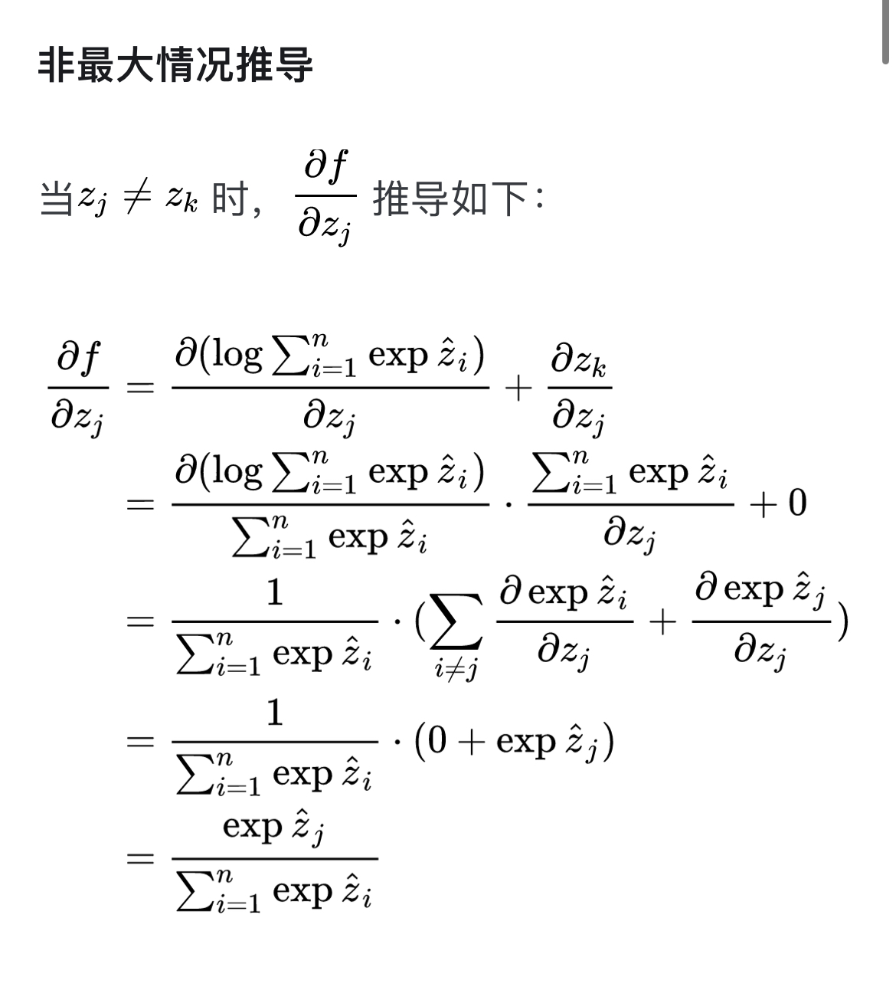
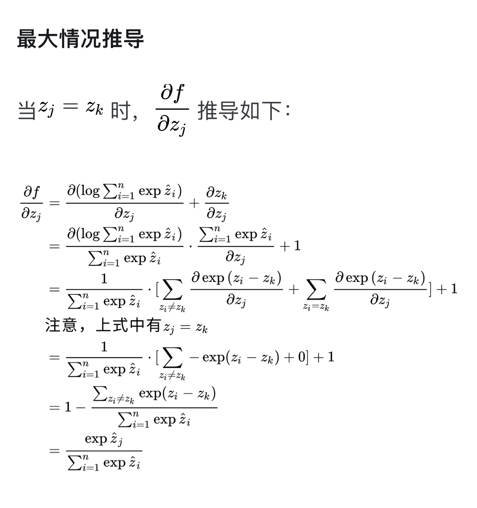

## Question 2

In this question, you will implement additional modules in `python/needle/nn/nn_basic.py`. Specifically, for the following modules described below, initialize any variables of the module in the constructor, and fill out the `forward` method. **Note:** Be sure that you are using the `init` functions that you just implemented to initialize the parameters, and don't forget to pass the `dtype` argument.
___

### Linear
`needle.nn.Linear(in_features, out_features, bias=True, device=None, dtype="float32")`

Applies a linear transformation to the incoming data: $y = xA^T + b$. The input shape is $(N, H_{in})$ where $H_{in}=\text{infeatures}$. The output shape is $(N, H_{out})$ where $H_{out}=\text{outfeatures}$.

Be careful to explicitly broadcast the bias term to the correct shape -- Needle does not support implicit broadcasting.

**Note:** for all layers including this one, you should initialize the weight Tensor before the bias Tensor, and should initialize all Parameters using only functions from `init`.

##### Parameters
- `in_features` - size of each input sample
- `out_features` - size of each output sample
- `bias` - If set to `False`, the layer will not learn an additive bias.

##### Variables
- `weight` - the learnable weights of shape (`in_features`, `out_features`). The values should be initialized with the Kaiming Uniform initialization with `fan_in = in_features`
- `bias` - the learnable bias of shape (1, `out_features`). The values should be initialized with the Kaiming Uniform initialize with `fan_in = out_features`. **Note the difference in fan_in choice, due to their relative sizes**.

**Code implementation**
```python
class Linear(Module):
    def __init__(
        self, in_features, out_features, bias=True, device=None, dtype="float32"
    ):
        super().__init__()
        self.in_features = in_features
        self.out_features = out_features

        ### BEGIN YOUR SOLUTION
        # Initialize weights with Kaiming Uniform initialization (fan_in = in_features)
        self.weight = Parameter(
            init.kaiming_uniform(in_features, out_features, nonlinearity="relu", device=device, dtype=dtype)
        )
        # Initialize bias if applicable (shape = (1, out_features))
        if bias:
            # Initialize the bias, and then reshape it to (1, out_features)
            self.bias = Parameter(
                ops.reshape(
                    init.kaiming_uniform(out_features, 1, nonlinearity="relu", device=device, dtype=dtype),
                    (1, out_features)
                )
            )
        else:
            self.bias = None
        ### END YOUR SOLUTION

    def forward(self, X: Tensor) -> Tensor:
        ### BEGIN YOUR SOLUTION
        output = ops.matmul(X, self.weight)
        if self.bias is not None:
            self.bias = ops.broadcast_to(self.bias, output.shape)
            output = ops.add(output, self.bias)
        return output
        ### END YOUR SOLUTION
```

### My explanation

The `Linear` layer performs a linear transformation on the input data, where the input tensor `X` has a shape of $(N, H_{in})$ (with $H_{in}$ representing `in_features`). This tensor is multiplied by a weight matrix `W`, initialized with the Kaiming Uniform method, and has a shape of $(H_{in}, H_{out})$ (with $H_{out}$ representing `out_features`), producing an output tensor of shape $(N, H_{out})$. If a bias term is included, it is also initialized with the Kaiming Uniform method, starting with a shape of $(H_{out}, 1)$ and then reshaped to $(1, H_{out})$. This reshaped bias is explicitly broadcasted to match the output tensor's shape of $(N, H_{out})$, allowing it to be added element-wise to the output. Both the weight and bias are encapsulated in `Parameter` objects, which the framework recognizes as learnable during the training process. This meticulous handling of shapes, initialization, and broadcasting ensures the layer accurately performs the linear transformation, with the bias being correctly applied across all batch samples.

___
### ReLU
`needle.nn.ReLU()`

Applies the rectified linear unit function element-wise:
$ReLU(x) = max(0, x)$.

If you have previously implemented ReLU's backwards pass in terms of itself, note that this is numerically unstable and will likely cause problems down the line.
Instead, consider that we could write the derivative of ReLU as $I\{x>0\}$, where we arbitrarily decide that the derivative at $x=0$ is 0.
(This is a _subdifferentiable_ function.)

**Code Implementation**
```python
class ReLU(Module):
    def forward(self, x: Tensor) -> Tensor:
        ### BEGIN YOUR SOLUTION
        return ops.relu(x)
        ### END YOUR SOLUTION
```

#### My explanation

**Subdifferentiable Function:** The note mentions that ReLU is a subdifferentiable function. This means that at the point $x = 0$, the function is not strictly differentiable because it has a "kink" or a sharp corner. However, in practice, we often define the derivative at this point to be 0 arbitrarily, which simplifies the computation and avoids instability.

```python
class ReLU(Module):
    def forward(self, x: Tensor) -> Tensor:
        ### BEGIN YOUR SOLUTION
        return ops.relu(x)
        ### END YOUR SOLUTION
```
**How the `compute` Method is Triggered**

1.  **Operation Definition (`Op` and `TensorOp` Classes)**:
    
    -   The `Op` class defines a general interface for operations (like addition, multiplication, etc.).
    -   The `TensorOp` class is a subclass of `Op` that is specialized for operations that output tensors.
2.  **Calling an Operation (`__call__` Method in `TensorOp`)**:
    
    -   When you call an operation, such as `ops.relu(x)`, it uses the `__call__` method of the `TensorOp` class.
    -   This method is responsible for creating a `Tensor` (or `TensorTuple`) that represents the result of the operation.
    -   Inside `__call__`, the method `Tensor.make_from_op(self, args)` is called, where `self` is the `ReLU` operation instance, and `args` contains the input tensor(s).
3.  **Creating a Tensor (`make_from_op` Method)**:
    
    -   The `make_from_op` method in the `Tensor` class creates a new `Tensor` object that represents the output of the operation.
    -   The operation (`op`) and the input tensor(s) (`inputs`) are stored in this `Tensor`.
    -   If the `LAZY_MODE` flag is `False`, the `Tensor` will immediately realize its data by calling the `realize_cached_data` method.
4.  **Realizing Cached Data (`realize_cached_data` Method)**:
    
    -   The `realize_cached_data` method checks if the data for the tensor has already been computed (cached). If not, it triggers the computation by calling the `compute` method of the operation.
    -   Specifically, it calls `self.op.compute(*[x.realize_cached_data() for x in self.inputs])`.
    -   This line of code triggers the `compute` method of the `ReLU` operation, which applies the ReLU function to the input tensor(s).


___


### Sequential

`needle.nn.Sequential(*modules)`

Applies a sequence of modules to the input (in the order that they were passed to the constructor) and returns the output of the last module.

These should be kept in a `.module` property: you should _not_ redefine any magic methods like `__getitem__`, as this may not be compatible with our tests.

##### Parameters

- `*modules` - any number of modules of type `needle.nn.Module`


**Code implementation**
```python
class Sequential(Module):
    def __init__(self, *modules):
        super().__init__()
        self.modules = modules

    def forward(self, x: Tensor) -> Tensor:
        ### BEGIN YOUR SOLUTION
        for module in self.modules:
            x = module(x)
        return x
        ### END YOUR SOLUTION
```

#### My explanation

**Understanding Module**
Based on the code, a `Module` is an abstract representation of a neural network component. It could be a layer (like a linear layer, convolutional layer), a function (like ReLU), or a composite structure that combines several layers (like `Sequential`). The `Module` class is designed to be subclassed so that specific layers and models can be created by extending it.

```python
 def __call__(self, *args, **kwargs):
        return self.forward(*args, **kwargs)
```
The `__call__` method makes an instance of `Module` callable, meaning you can use it like a function. When you call an instance of a `Module`, it automatically invokes the `forward` method.

**Understanding Sequential**
The `Sequential` class is a specific type of `Module` that is designed to chain together multiple `Module` objects and apply them in sequence to an input tensor. The `Sequential` class makes it easy to define a neural network by simply listing out the layers or operations in the order they should be applied.

```python
class Sequential(Module):
    def __init__(self, *modules):
        super().__init__()
        self.modules = modules

    def forward(self, x: Tensor) -> Tensor:
        ### BEGIN YOUR SOLUTION
        for module in self.modules:
            x = module(x)
        return x
        ### END YOUR SOLUTION
```

**Initialization (`__init__` method)**:

-   The `__init__` method in the `Sequential` class takes any number of `Module` objects as arguments, using the `*modules` syntax. This allows you to pass in a flexible number of modules (layers, activations, etc.).
-   These modules are stored in the `self.modules` attribute as a tuple.

>### Understanding `*modules` Syntax
>**`*args` in Python**:
> -   When you define a function or method with an argument like `*args`, it means that the function can accept any number of positional arguments. All these arguments are then collected into a single tuple named `args`.
> - For example:
```python
def example_function(*args):
    print(args)
example_function(1, 2, 3)
# This will print: `(1, 2, 3)`.
```
Example usage:
```python
model = Sequential(Linear(10, 20), ReLU(), Linear(20, 10))
output = model(input_tensor)
```
___


### LogSumExp

  

`needle.ops.LogSumExp(axes)`


Here you will need to implement one additional operatior in the `python/needle/ops/ops_logarithmic.py` file, as you did in HW1. Applies a numerically stable log-sum-exp function to the input by subtracting off the maximum elements.


$$\text{LogSumExp}(z) = \log (\sum_{i} \exp (z_i - \max{z})) + \max{z}$$

#### Parameters

- `axes` - Tuple of axes to sum and take the maximum element over. This uses the same conventions as `needle.ops.Summation()`


**Code implementation**
```python

```

### My explanation for  def compute(self, Z)
```python
class LogSumExp(TensorOp):
    def __init__(self, axes: Optional[tuple] = None):
        self.axes = axes

    def compute(self, Z):
        ### BEGIN YOUR SOLUTION
        max_z_with_dim = array_api.max(Z, axis=self.axes, keepdims=True)
        max_z_no_dim = array_api.max(Z, axis=self.axes, keepdims=False)
        out = array_api.log(array_api.sum(array_api.exp(Z - max_z_with_dim), axis=self.axes, keepdims=False)) + max_z_no_dim
        return out
        ### END YOUR SOLUTION
```

A **reduction operation** in the context of data processing and computational frameworks like NumPy, TensorFlow, or PyTorch refers to an operation that reduces the number of elements in an array or tensor by performing some form of aggregation. This aggregation is typically done along specific dimensions (axes) of the data.

Here are some common examples of reduction operations:

1.  **Sum (`np.sum`)**:
    
    -   Adds up all the elements in an array or along a specified axis.
    -   Example: Summing the elements in a matrix to get a single number (scalar) or a reduced matrix.

2.  **Maximum (`np.max`)**:
	-   Finds the maximum value among all the elements in an array or along a specified axis.
	-   Example: Finding the maximum value in each row or column of a matrix.

#### Explain `axis` in NumPy

The `axis` parameter in NumPy specifies the dimension along which an operation is performed. The key is to remember that:

-   **`axis=0`**: Operations are performed **down the rows** (i.e., along columns).
-   **`axis=1`**: Operations are performed **across the columns** (i.e., along rows).

**Example with `np.max`**
Given the array `Z`:
```python
Z = np.array([[1, 2, 3],
              [4, 5, 6]])  # Shape: (2, 3)
```
This is a 2D array (matrix) with 2 rows and 3 columns.

#### Case 1: `np.max(Z, axis=0)`

-   **Operation**: Find the maximum along `axis=0` (which means across rows, down each column).
-   **Result**: You get the maximum value in each column.
```python
max_axis0 = np.max(Z, axis=0)
# max_axis0 = [4, 5, 6]
# Shape: (3,)
```
Here, `axis=0` corresponds to reducing the rows, so the operation is applied across rows, resulting in one value per column.

#### Case 2: `np.max(Z, axis=1)`

-   **Operation**: Find the maximum along `axis=1` (which means across columns, for each row).
-   **Result**: You get the maximum value in each row.
```python
max_axis1 = np.max(Z, axis=1)
# max_axis1 = [3, 6]
# Shape: (2,)
```
Here, `axis=1` corresponds to reducing the columns, so the operation is applied across columns within each row, resulting in one value per row.

**Understanding whole code**
```python
class LogSumExp(TensorOp):
    def __init__(self, axes: Optional[tuple] = None):
        self.axes = axes

    def compute(self, Z):
        ### BEGIN YOUR SOLUTION
        max_z_with_dim = array_api.max(Z, axis=self.axes, keepdims=True)
        max_z_no_dim = array_api.max(Z, axis=self.axes, keepdims=False)
        out = array_api.log(array_api.sum(array_api.exp(Z - max_z_with_dim), axis=self.axes, keepdims=False)) + max_z_no_dim
        return out
        ### END YOUR SOLUTION
  ```
 Let's go through an example using the `compute` method step by step, showing the shapes and the intermediate results for each line of the code.
#### Example Setup
Consider the following 2D array `Z`:
```python
import numpy as np

Z = np.array([[1, 2, 3],
              [4, 5, 6]])  # Shape: (2, 3)
```
We'll assume that `self.axes = 1`, meaning we are going to apply the `LogSumExp` operation across the columns (axis 1) of the array `Z`.

### Step-by-Step Execution

#### 1. Compute `max_z_with_dim`
```python
max_z_with_dim = np.max(Z, axis=1, keepdims=True)
```
-   **Operation**: Compute the maximum value along the specified axis (`axis=1`), while keeping the dimensions.
-   **Result**:
	```python
	max_z_with_dim = np.array([[3],   # Max of [1, 2, 3] is 3
                               [6]])  # Max of [4, 5, 6] is 6
	```
- **Shape**: `(2, 1)`

	-   The result keeps the reduced dimension as a size-1 dimension, which is crucial for broadcasting in the next steps.
	
#### 2. Compute `max_z_no_dim`
```python
max_z_no_dim = np.max(Z, axis=1, keepdims=False)
```
-   **Operation**: Compute the maximum value along the specified axis (`axis=1`), without keeping the dimensions.
-   **Result**
	```python
	max_z_no_dim = np.array([3, 6])  # Max of [1, 2, 3] is 3, 		Max of [4, 5, 6] is 6
	```
- **Shape**: `(2,)`
	-   The result is a 1D array where the dimension over which the operation was performed has been collapsed.

#### 3. Compute the LogSumExp
```python
shifted = Z - max_z_with_dim
exp_shifted = np.exp(shifted)
sum_exp_shifted = np.sum(exp_shifted, axis=1, keepdims=False)
log_sum_exp_shifted = np.log(sum_exp_shifted)
```
Let's break it down further:

**a. Subtract `max_z_with_dim` from `Z`**:
```python
shifted = Z - max_z_with_dim
# shifted = [[1-3, 2-3, 3-3],   # Subtract 3 from each element in the first row
#            [4-6, 5-6, 6-6]]   # Subtract 6 from each element in the second row
#         = [[-2, -1, 0],
#            [-2, -1, 0]]
# Shape: (2, 3)
```
-   **Shape**: `(2, 3)` (same as `Z`), because `max_z_with_dim` was broadcast to match the shape of `Z`.

**b. Exponentiate the shifted result**:
```python
exp_shifted = np.exp(shifted)
# exp_shifted = [[exp(-2), exp(-1), exp(0)],
#                [exp(-2), exp(-1), exp(0)]]
#             = [[0.1353, 0.3679, 1.0000],
#                [0.1353, 0.3679, 1.0000]]
# Shape: (2, 3)
```
-   **Shape**: `(2, 3)`, since exponentiation is applied element-wise.

**c. Sum the exponentiated values along `axis=1`**:
```python
sum_exp_shifted = np.sum(exp_shifted, axis=1, keepdims=False)
# sum_exp_shifted = [0.1353 + 0.3679 + 1.0000,  # Sum across the columns for the first row
#                    0.1353 + 0.3679 + 1.0000]  # Sum across the columns for the second row
#                = [1.5032, 1.5032]
# Shape: (2,)
```
-   **Shape**: `(2,)`, because we summed along `axis=1`, collapsing that dimension.

**d. Take the logarithm of the summed values**:
```python
log_sum_exp_shifted = np.log(sum_exp_shifted)
# log_sum_exp_shifted = [log(1.5032), log(1.5032)]
#                    = [0.4076, 0.4076]
# Shape: (2,)
```
-   **Shape**: `(2,)`, since the logarithm is applied element-wise to the summed result.

#### 4. Add `max_z_no_dim` to `log_sum_exp_shifted`
```python
out = log_sum_exp_shifted + max_z_no_dim
# out = [0.4076 + 3, 0.4076 + 6]
#     = [3.4076, 6.4076]
# Shape: (2,)
```
-   **Operation**: Add `max_z_no_dim` to `log_sum_exp_shifted`, element-wise.
-   **Result**:
	```python
	out = np.array([3.4076, 6.4076])
	```
- **Shape**: `(2,)`, matching the shape of `log_sum_exp_shifted` and `max_z_no_dim`.

### Final Output
The final output of the `compute` method is:
```python
out = np.array([3.4076, 6.4076])  # Shape: (2,)
```
### Summary of Shapes

1.  **`max_z_with_dim`**: Shape `(2, 1)` — Maximum values along the specified axis, with dimensions retained.
2.  **`max_z_no_dim`**: Shape `(2,)` — Maximum values along the specified axis, without retaining dimensions.
3.  **`shifted`**: Shape `(2, 3)` — Result of subtracting `max_z_with_dim` from `Z`.
4.  **`exp_shifted`**: Shape `(2, 3)` — Exponentiated values after the shift.
5.  **`sum_exp_shifted`**: Shape `(2,)` — Summed exponentiated values along the specified axis.
6.  **`log_sum_exp_shifted`**: Shape `(2,)` — Logarithm of the summed exponentiated values.
7.  **`out`**: Shape `(2,)` — Final result after adding back the max values without dimensions.

### My explanation for  def gradient(self, out_grad, node):
```python
def gradient(self, out_grad, node):
```

### Derivation Process 
#### Symbol Explanation 
The symbols used in the derivation process are explained as follows:

$$z \in \mathbb{R}^n$$

$$z_k = \max z$$

$$\hat{z} = z - \max z$$

$$f = \log \sum_{i=1}^{n} \exp(z_i - \max z) + \max z$$

$$= \log \sum_{i=1}^{n} \exp \hat{z}_i + z_k$$


### Non-Maximum Case Derivation

When $z_j \neq z_k$, the derivation of $\frac{\partial f}{\partial z_j}$ is as follows:


$$\begin{equation}\begin{aligned}
\frac{\partial f}{\partial z_j} &= \frac{\partial \left( \log \sum_{i=1}^{n} \exp \hat{z}_i \right)}{\partial z_j} + \frac{\partial z_k}{\partial z_j} \\
&= \frac{\partial \left( \log \sum_{i=1}^{n} \exp \hat{z}_i \right)}{\partial z_j} \cdot \frac{\partial \sum_{i=1}^{n} \exp \hat{z}_i}{\partial z_j} + 0 \\
&= \frac{1}{\sum_{i=1}^{n} \exp \hat{z}_i} \cdot \left(\sum_{i \neq j} \frac{\partial \exp \hat{z}_i}{\partial z_j} + \frac{\partial \exp \hat{z}_j}{\partial z_j}\right) \\
&= \frac{1}{\sum_{i=1}^{n} \exp \hat{z}_i} \cdot \left(0 + \exp \hat{z}_j\right) \\
&= \frac{\exp \hat{z}_j}{\sum_{i=1}^{n} \exp \hat{z}_i}\end{aligned}\end{equation}$$



### Maximum Case Derivation

When $z_j = z_k$, the derivation of $\frac{\partial f}{\partial z_j}$ is as follows:

$$\begin{equation}
\begin{aligned}
\frac{\partial f}{\partial z_j} &= \frac{\partial \left( \log \sum_{i=1}^{n} \exp \hat{z}_i \right)}{\partial z_j} + \frac{\partial z_k}{\partial z_j} \\
&= \frac{\partial \left( \log \sum_{i=1}^{n} \exp \hat{z}_i \right)}{\partial z_j} \cdot \frac{\partial \sum_{i=1}^{n} \exp \hat{z}_i}{\partial z_j} + 1 \\
&= \frac{1}{\sum_{i=1}^{n} \exp \hat{z}_i} \cdot \left[ \sum_{z_i \neq z_k} \frac{\partial \exp(z_i - z_k)}{\partial z_j} + \sum_{z_i = z_k} \frac{\partial \exp(z_i - z_k)}{\partial z_j} \right] + 1 \\
&= \frac{1}{\sum_{i=1}^{n} \exp \hat{z}_i} \cdot \left[ \sum_{z_i \neq z_k} - \exp(z_i - z_k) + 0 \right] + 1
\end{aligned}\end{equation}$$

Note, in the above equation, $z_j = z_k$

$$\begin{equation}
\begin{aligned} &= 1 - \frac{\sum_{z_i \neq z_k} \exp(z_i - z_k)}{\sum_{i=1}^{n} \exp \hat{z}_i}\\
&= \frac{\exp \hat{z}_j}{\sum_{i=1}^{n} \exp \hat{z}_i}
\end{aligned}\end{equation}$$



### General Case

Note that whether $z_j$ is the maximum value or not, the following holds:

$$\frac{\partial f}{\partial z_j} = \frac{\exp \hat{z}_j}{\sum_{i=1}^{n} \exp \hat{z}_i} = \exp(z_j - \text{LogSumExp}(z) )$$

### Prove $\frac{\exp \hat{z}_j}{\sum_{i=1}^{n} \exp \hat{z}_i} = \exp(z_j - \text{LogSumExp}(z) )$

We need to prove that:

$$\frac{\exp(Z_i - \max(Z))}{\sum_{j} \exp(Z_j - \max(Z))} = \exp\left(Z_i - \text{LogSumExp}(Z)\right)$$

#### Step 1: Start with the Left Side
Start with the left side:

$$\frac{\exp(Z_i - \max(Z))}{\sum_{j} \exp(Z_j - \max(Z))}$$

#### Step 2: Express the Denominator Using Logarithm and Exponential
Recognize that the denominator can be rewritten using the logarithm-exponential identity:

$$\sum_{j} \exp(Z_j - \max(Z)) = \exp\left(\log\left(\sum_{j} \exp(Z_j - \max(Z))\right)\right)$$

Thus, the expression becomes:

$$\frac{\exp(Z_i - \max(Z))}{\exp\left(\log\left(\sum_{j} \exp(Z_j - \max(Z))\right)\right)}$$

#### Step 3: Simplify the Fraction
Now, recall the identity:

$$\frac{\exp(A)}{\exp(B)} = \exp(A - B)$$

Applying this identity to our expression:

$$\frac{\exp(Z_i - \max(Z))}{\exp\left(\log\left(\sum_{j} \exp(Z_j - \max(Z))\right)\right)} = \exp\left((Z_i - \max(Z)) - \log\left(\sum_{j} \exp(Z_j - \max(Z))\right)\right)$$

#### Step 4: Combine the Terms
Simplify the expression by combining terms:

$$\exp\left(Z_i - \max(Z) - \log\left(\sum_{j} \exp(Z_j - \max(Z))\right)\right)$$

#### Step 5: Recognize the Expression for LogSumExp
Recall that:

$$\text{LogSumExp}(Z) = \log\left(\sum_{j} \exp(Z_j - \max(Z))\right) + \max(Z)$$

So:

$$\exp\left(Z_i - \max(Z) - \log\left(\sum_{j} \exp(Z_j - \max(Z))\right)\right) = \exp\left(Z_i - \left[\log\left(\sum_{j} \exp(Z_j - \max(Z))\right) + \max(Z)\right]\right)$$


#### Step 6: Simplify to the Final Form
Finally, recognize that the expression we've derived on the right is exactly the right side of the original equation:

$$\exp\left(Z_i - \text{LogSumExp}(Z)\right)$$

#### Conclusion
We have successfully shown that starting from the left side of the equation and using basic logarithm and exponential identities, we can derive the right side. This proves that:

$$\frac{\exp(Z_i - \max(Z))}{\sum_{j} \exp(Z_j - \max(Z))} = \exp\left(Z_i - \text{LogSumExp}(Z)\right)$$
