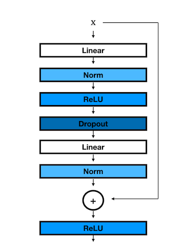
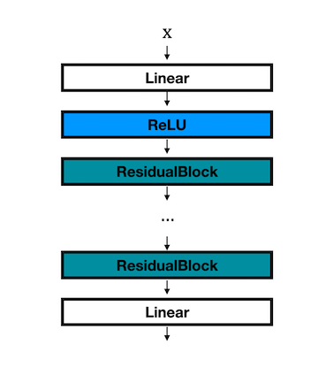

## Question 5

Given you have now implemented all the necessary components for our neural network library, let's build and train an MLP ResNet. For this question, you will be working in `apps/mlp_resnet.py`. First, fill out the functions `ResidualBlock` and `MLPResNet` as described below:


### ResidualBlock

`ResidualBlock(dim, hidden_dim, norm=nn.BatchNorm1d, drop_prob=0.1)`

  

Implements a residual block as follows:

  



**NOTE**: if the figure does not render, please see the figure in the `figures` directory.

  

where the first linear layer has `in_features=dim` and `out_features=hidden_dim`, and the last linear layer has `out_features=dim`. Returns the block as type `nn.Module`.

  

##### Parameters

- `dim` (*int*) - input dim

- `hidden_dim` (*int*) - hidden dim

- `norm` (*nn.Module*) - normalization method

- `drop_prob` (*float*) - dropout probability

  
**Code Implementation:**
 
```python
  def ResidualBlock(dim, hidden_dim, norm=nn.BatchNorm1d, drop_prob=0.1):
    ### BEGIN YOUR SOLUTION
    return nn.Sequential(
        nn.Residual(
            nn.Sequential(
                nn.Linear(dim, hidden_dim),
                norm(hidden_dim),
                nn.ReLU(),
                nn.Dropout(drop_prob),
                nn.Linear(hidden_dim, dim),
                norm(dim)
            )
        ),
        nn.ReLU()
    )
    ### END YOUR SOLUTION
```
___

### Explaination of ResidualBlock
 
 The `ResidualBlock` function  is designed to implement a residual block commonly used in deep learning models, specifically in ResNet architectures. A residual block helps in training deeper networks by allowing gradients to flow through the network more effectively, mitigating the vanishing gradient problem.

#### 1. **Function Definition:**

-   **`dim` (int):** The dimensionality of the input.
-   **`hidden_dim` (int):** The dimensionality of the hidden layer inside the residual block.
-   **`norm` (nn.Module):** A normalization method (like `nn.BatchNorm1d`), applied after each linear layer.
-   **`drop_prob` (float):** The dropout probability, used to prevent overfitting by randomly setting a fraction of the input units to 0 during training.

#### 2. **Return Value:**

-   The function returns an instance of `nn.Sequential`, which is a sequential container of layers/modules that will be executed in the order they are defined.

#### 3. **Inner Structure:**

-   **`nn.Sequential`:** The outer `nn.Sequential` container applies layers sequentially.
    
-   **`nn.Residual`:**
    
    -   This wrapper encapsulates the sequence of layers defined within it. The `nn.Residual` module adds the input (skip connection) to the output of the layers inside the sequence, forming a residual connection. This is key to allowing the gradients to bypass the non-linearities, aiding in the training of deeper networks.
-   **Inner `nn.Sequential`:**
    
    -   **`nn.Linear(dim, hidden_dim)`:** The first linear layer projects the input of dimension `dim` to a higher dimension `hidden_dim`.
    -   **`norm(hidden_dim)`:** Applies normalization (like BatchNorm) to the output of the first linear layer to stabilize and speed up training.
    -   **`nn.ReLU()`:** Applies the ReLU (Rectified Linear Unit) activation function, introducing non-linearity.
    -   **`nn.Dropout(drop_prob)`:** Applies dropout to the output, with the probability `drop_prob` of dropping units, to prevent overfitting.
    -   **`nn.Linear(hidden_dim, dim)`:** The second linear layer projects the `hidden_dim` back to the original input dimension `dim`.
    -   **`norm(dim)`:** Normalization is applied again to stabilize the final output before adding the residual connection.
-   **`nn.ReLU()`:** Finally, after the residual connection is applied, another ReLU activation is applied to the combined output, which is a common practice in residual networks.

#### **Explanation of  Layers and Their Input:**

1.  **First Linear Layer (`nn.Linear(dim, hidden_dim)`):**
    
    -   **Input:** The input to this layer has the shape `(batch_size, dim)`.
    -   **Function:** This layer transforms the input from the original dimensionality `dim` to a higher dimensionality `hidden_dim`.
    -   **Output:** The output shape is `(batch_size, hidden_dim)`.
2.  **Normalization Layer (`norm(hidden_dim)`):**
    
    -   **Input:** The input is the output from the first linear layer, which has a shape of `(batch_size, hidden_dim)`.
    -   **Function:** This normalization layer (e.g., BatchNorm1d) normalizes the output to stabilize the training process and make the model converge faster.
    -   **Output:** The output shape remains `(batch_size, hidden_dim)`.
3.  **ReLU Activation (`nn.ReLU()`):**
    
    -   **Input:** The input is the normalized output from the previous layer, with a shape of `(batch_size, hidden_dim)`.
    -   **Function:** ReLU introduces non-linearity into the model by applying the ReLU activation function.
    -   **Output:** The output shape remains `(batch_size, hidden_dim)`.
4.  **Dropout Layer (`nn.Dropout(drop_prob)`):**
    
    -   **Input:** The input is the activated output from the ReLU layer, with a shape of `(batch_size, hidden_dim)`.
    -   **Function:** The Dropout layer randomly sets a fraction of the inputs to zero with probability `drop_prob` to prevent overfitting.
    -   **Output:** The output shape remains `(batch_size, hidden_dim)`.
5.  **Second Linear Layer (`nn.Linear(hidden_dim, dim)`):**
    
    -   **Input:** The input is the output from the Dropout layer, which has a shape of `(batch_size, hidden_dim)`.
    -   **Function:** This layer projects the data back from the higher dimensionality `hidden_dim` to the original input dimensionality `dim`.
    -   **Output:** The output shape is `(batch_size, dim)`.
6.  **Second Normalization Layer (`norm(dim)`):**
    
    -   **Input:** The input is the output from the second linear layer, which has a shape of `(batch_size, dim)`.
    -   **Function:** This normalization layer normalizes the output again to stabilize the output of the residual block.
    -   **Output:** The output shape remains `(batch_size, dim)`.

#### **Residual Connection (Implemented in `nn.Residual`):**

-   **Input:** The original input to the block, with a shape of `(batch_size, dim)`, is passed unchanged to the `nn.Residual` wrapper.
-   **Function:** Inside the `nn.Residual`, the output from the inner `nn.Sequential` block (which has gone through all the transformations) is added element-wise to the original input.
-   **Output:** The final output after the residual addition has the same shape as the original input, `(batch_size, dim)`.

#### **Final ReLU Activation:**

-   **Input:** The input to this layer is the result of the residual connection, which has a shape of `(batch_size, dim)`.
-   **Function:** This ReLU activation is applied to the output of the residual connection.
-   **Output:** The final output shape remains `(batch_size, dim)`.

#### **Summary:**

-   The input starts with a shape of `(batch_size, dim)`.
-   It is transformed into a higher-dimensional space `(batch_size, hidden_dim)` through the first linear layer and goes through normalization, ReLU activation, and dropout.
-   It is then projected back to `(batch_size, dim)` through the second linear layer and normalization.
-   Finally, the original input (with shape `(batch_size, dim)`) is added to this transformed output, creating a residual connection, which is followed by a ReLU activation.

The entire block helps maintain the identity of the input through the network while still allowing transformations to occur, enabling the training of very deep networks more effectively.

___

  

### MLPResNet

`MLPResNet(dim, hidden_dim=100, num_blocks=3, num_classes=10, norm=nn.BatchNorm1d, drop_prob=0.1)`

  

Implements an MLP ResNet as follows:

  




  

where the first linear layer has `in_features=dim` and `out_features=hidden_dim`, and each ResidualBlock has `dim=hidden_dim` and `hidden_dim=hidden_dim//2`. Returns a network of type `nn.Module`.

  

##### Parameters

- `dim` (*int*) - input dim

- `hidden_dim` (*int*) - hidden dim

- `num_blocks` (*int*) - number of ResidualBlocks

- `num_classes` (*int*) - number of classes

- `norm` (*nn.Module*) - normalization method

- `drop_prob` (*float*) - dropout probability (0.1)

**Code Implementation:**

```python
def MLPResNet(
    dim,
    hidden_dim=100,
    num_blocks=3,
    num_classes=10,
    norm=nn.BatchNorm1d,
    drop_prob=0.1,
):
    ### BEGIN YOUR SOLUTION
    layers = [
        nn.Linear(dim, hidden_dim),
        nn.ReLU()
    ]
    
    for _ in range(num_blocks):
        layers.append(ResidualBlock(hidden_dim, hidden_dim // 2, norm, drop_prob))
    
    layers.append(nn.Linear(hidden_dim, num_classes))
    
    return nn.Sequential(*layers)
    ### END YOUR SOLUTION
```

___

  
### Explanation of `MLPResNet`

The `MLPResNet` function is designed to implement a multi-layer perceptron (MLP) with residual connections, inspired by the ResNet architecture. This model is particularly useful for tasks where you need the network to have depth and the benefits of residual connections, which help in training deeper networks by addressing issues like vanishing gradients.

#### **1. Function Definition and Parameters:**

-   **`dim` (int):** The dimensionality of the input features.
-   **`hidden_dim` (int):** The dimensionality of the hidden layers in the network. This defaults to 100.
-   **`num_blocks` (int):** The number of residual blocks in the network. Each block contains layers that apply transformations while also maintaining the identity of the input through residual connections. This defaults to 3.
> When we say that a residual block "maintains the identity of the input," we're referring to the fact that the original input is preserved and directly passed through the block, in addition to any transformations applied by the block. This feature helps stabilize and enhance the training of deep neural networks by addressing problems like vanishing gradients and making it easier for the network to learn identity mappings where needed. Mathematically, if the input is $x$, the identity mapping is simply $f(x) = x$.
-   **`num_classes` (int):** The number of output classes, which determines the dimensionality of the final output layer. This defaults to 10.
-    **`norm` (nn.Module):** The normalization method to be applied after each linear transformation within each `ResidualBlock`, typically `nn.BatchNorm1d`.
-   **`drop_prob` (float):** The dropout probability, which is used to randomly set a fraction of the input units to 0 during training, reducing overfitting. This defaults to 0.1.

#### **2. Building the Network:**

The function constructs the MLPResNet as a sequence of layers, where each layer is added to a list called `layers`. After defining all the necessary layers, the list is passed to `nn.Sequential`, which chains the layers together in the specified order.

#### **3. Step-by-Step Explanation:**

1.  **Initial Linear Layer:**
    
    -   **Code:** `nn.Linear(dim, hidden_dim)`
    -   **Explanation:** The first layer of the network takes the input features with dimensionality `dim` and projects them into a higher-dimensional space `hidden_dim`. This layer is followed by a ReLU activation function to introduce non-linearity.
    -   **Purpose:** This transformation sets the stage for the subsequent residual blocks, increasing the expressiveness of the model.
2.  **Residual Blocks:**
    
    -   **Code:** `for _ in range(num_blocks): layers.append(ResidualBlock(hidden_dim, hidden_dim // 2, norm, drop_prob))`
    -   **Explanation:** The function iteratively adds a specified number of `ResidualBlock` modules to the network. Each residual block is created using the `hidden_dim` as its input and output dimension, with the internal hidden dimension set to `hidden_dim // 2`. The norm and dropout probability are also passed to each block.
    -   **Purpose:** These blocks allow the network to learn complex representations while preserving the ability to bypass layers if necessary, facilitating the flow of gradients during training. This makes it possible to build and train deeper networks.
3.  **Final Linear Layer:**
    
    -   **Code:** `layers.append(nn.Linear(hidden_dim, num_classes))`
    -   **Explanation:** After passing through all the residual blocks, the network includes a final linear layer that reduces the dimensionality from `hidden_dim` to `num_classes`, which corresponds to the number of output classes.
    -   **Purpose:** This layer produces the final output of the network, which can be used for classification tasks. The output dimensionality matches the number of classes in the target dataset.
4.  **Return Statement:**
    
    -   **Code:** `return nn.Sequential(*layers)`
    -   **Explanation:** The list of layers, `layers`, is passed to `nn.Sequential`, which organizes them into a single, sequential model. This allows the network to be defined and executed in a straightforward manner.
    -   **Purpose:** The sequential model ensures that the input data passes through each layer in the correct order, producing the final output after all transformations are applied.

#### **4. Summary:**

-   **Architecture:** The `MLPResNet` model starts with an input layer that projects the input features into a higher-dimensional space. This is followed by a series of residual blocks, each designed to learn more complex features while preserving the input's identity through residual connections. Finally, the network concludes with an output layer that reduces the representation to the number of classes.
-   **Flexibility:** The function parameters allow customization of the model's depth (`num_blocks`), the size of hidden layers (`hidden_dim`), and the regularization (`drop_prob`). This flexibility makes it adaptable to different datasets and tasks.
-   **Purpose:** This architecture is well-suited for tasks where deep networks are needed, but with the benefits of residual connections to ease the training process and improve performance. The final output is suitable for classification tasks.

By constructing the MLPResNet in this manner, we can achieve a balance between depth, complexity, and the ability to train effectively, thanks to the residual connections.

___

  

Once you have the deep learning model architecture correct, let's train the network using our new neural network library components. Specifically, implement the functions `epoch` and `train_mnist`.

  

### Epoch

  

`epoch(dataloader, model, opt=None)`

  

Executes one epoch of training or evaluation, iterating over the entire training dataset once (just like `nn_epoch` from previous homeworks). Returns the average error rate (as a *float*) and the average loss over all samples (as a *float*). Set the model to `training` mode at the beginning of the function if `opt` is given; set the model to `eval` if `opt` is not given (i.e. `None`). When setting the modes, use `.train()` and `.eval()` instead of modifying the training attribute.

  

##### Parameters

- `dataloader` (*`needle.data.DataLoader`*) - dataloader returning samples from the training dataset

- `model` (*`needle.nn.Module`*) - neural network

- `opt` (*`needle.optim.Optimizer`*) - optimizer instance, or `None`

  
**Code Implementation**
```python
def epoch(dataloader, model, opt=None):
    np.random.seed(4)
    ### BEGIN YOUR SOLUTION
    # Set the model to training or evaluation mode once, based on whether an optimizer is provided
    if opt is None:
        model.eval()
    else:
        model.train()
        
    # Initialize the loss function and metrics
    loss_func = nn.SoftmaxLoss()
    total_loss = 0
    total_error = 0
    num_samples = len(dataloader.dataset)
    
    # Iterate over batches
    for batch_x, batch_y in dataloader:
        # Forward pass
        y_pred = model(batch_x)
        # Compute batch loss (average loss across the batch), which is a 0 dimensional tensor(a scalar tensor) with shape().
        # Type of batch_loss: <class 'needle.autograd.Tensor'>
        # Shape of batch_loss : ()
        batch_loss = loss_func(y_pred, batch_y)
        # Accumulate total loss (convert batch_loss to a NumPy scalar and multiply by batch size)
        # batch_loss.numpy() is a NumPy scalar (e.g., numpy.float64) with no dimensions (shape ()).
        total_loss += batch_loss.numpy() * batch_x.shape[0]
        
        # Backward pass and optimization (if in training mode)
        if opt is not None:
            # Clear the old gradients before computing the new ones for the current batch
            opt.reset_grad()
            # Perform backpropagation to compute the gradients of the loss with respect to each model parameter
            batch_loss.backward()
            # Update the model's parameters using the computed gradients
            opt.step()
            
        # Convert predictions and labels to numpy arrays
        batch_y = batch_y.numpy()
        y_pred = y_pred.numpy()
        # Calculate the number of incorrect predictions
        y_pred = np.argmax(y_pred, axis=1)
        total_error += np.sum(y_pred != batch_y)
        
    # Calculate error rate and average loss, both returned as NumPy scalars of type <class 'numpy.float64'>
    error_rate = total_error / num_samples
    average_loss = total_loss / num_samples
    return error_rate, average_loss
    ### END YOUR SOLUTION
```
___

### Understanding `np.random.seed`
The `np.random.seed()` function in NumPy is used to set the seed for the random number generator. A seed is a starting point for a sequence of pseudo-random numbers. By setting the seed, you ensure that the sequence of numbers generated by the random number generator is the same every time you run the code, which is essential for reproducibility.

### Why Use a Seed?

-   **Reproducibility:** When running experiments, especially in scientific computing and machine learning, you often need to ensure that your results can be reproduced. Setting a seed allows you to generate the same random numbers every time, making your results consistent.
-   **Debugging:** If you're debugging code that involves randomness, setting a seed can help you reproduce the same sequence of random numbers, making it easier to trace and fix issues.

#### Example Without Setting the Seed

```python
import numpy as np

# Generate random numbers without setting the seed
random_numbers1 = np.random.rand(5)
random_numbers2 = np.random.rand(5)

print("First set of random numbers (no seed):", random_numbers1)
print("Second set of random numbers (no seed):", random_numbers2)
# Output:
# First set of random numbers (no seed): [0.44171092 0.97951602 0.35944446 0.48089353 0.68866118]
# Second set of random numbers (no seed): [0.88047589 0.91823547 0.21655036 0.9370728  0.63317121]
```

#### Example With Setting the Seed
```python
import numpy as np

# Set the seed for reproducibility
np.random.seed(42)

# Generate random numbers with the seed set
random_numbers1 = np.random.rand(5)

# Reset the seed and generate again to ensure reproducibility
np.random.seed(42)
random_numbers2 = np.random.rand(5)

print("First set of random numbers (with seed):", random_numbers1)
print("Second set of random numbers (with seed):", random_numbers2)
# Output:
# First set of random numbers (with seed): [0.37454012 0.95071431 0.73199394 0.59865848 0.15601864]
# Second set of random numbers (with seed): [0.37454012 0.95071431 0.73199394 0.59865848 0.15601864]
```

-   **Without Seed:** The random numbers change every time you run the code because the random number generator starts from a different point each time.
-   **With Seed (`np.random.seed(42)`):** The random numbers are the same every time you run the code. This is because setting the seed ensures that the random number generator starts from the same point every time.

### Explanation of `epoch` Function

The `epoch` function is designed to execute one complete pass (or epoch) through the dataset using a provided model. It can be used for both training and evaluation, depending on whether an optimizer is provided. The function returns two key metrics: the average error rate and the average loss over all samples in the dataset.

#### **1. Function Definition and Parameters:**

-   **`dataloader` (`needle.data.DataLoader`):** This is an instance of a data loader that provides batches of data from the training dataset. The data loader iterates through the dataset and returns input data (`batch_x`) and corresponding labels (`batch_y`) in batches.
    
-   **`model` (`needle.nn.Module`):** This represents the neural network model that will be trained or evaluated. The model processes input data to generate predictions.
    
-   **`opt` (`needle.optim.Optimizer` or `None`):** This parameter is the optimizer instance used for updating the model's parameters during training. If `opt` is `None`, the model is set to evaluation mode, meaning no parameter updates are performed.
    

#### **2. Mode Setting:**

-   **Training Mode (`model.train()`):** If an optimizer is provided (`opt` is not `None`), the model is set to training mode. This prepares the model for backpropagation and parameter updates.
    
-   **Evaluation Mode (`model.eval()`):** If no optimizer is provided (`opt` is `None`), the model is set to evaluation mode. In this mode, the model only performs a forward pass without updating its parameters.
    

#### **3. Loss Function and Metrics Initialization:**

-   **Loss Function:** The loss function used here is `nn.SoftmaxLoss()`, which is typically used for classification tasks where the model's output (logits) is compared against the true labels to calculate the loss. 
 
-   **Metrics:**
    
    -   `total_loss`: This variable accumulates the total loss across all samples in the dataset.
    -   `total_error`: This variable counts the number of incorrect predictions.
    -   `num_samples`: The total number of samples in the dataset, used to calculate average metrics.

#### **4. Iteration Over Batches:**

The function loops over each batch of data provided by the `dataloader`:

-   **Forward Pass:**
    
    -   The model processes the input batch (`batch_x`) to generate logits (`y_pred`).
    -   The loss for the batch is calculated using the loss function, comparing the logits to the true labels (`batch_y`).

-   **Accumulating Loss:**
    
    -   The batch loss is converted to a NumPy scalar and multiplied by the batch size to get the total loss for that batch.
    -   This loss is added to `total_loss`.
-   **Backward Pass and Optimization (Training Mode Only):**
    
    -   If in training mode (i.e., `opt` is not `None`), the gradients are reset (`opt.reset_grad()`), the loss is backpropagated through the network (`batch_loss.backward()`), and the model's parameters are updated using the optimizer (`opt.step()`).
-   **Calculating Error:**
    
    -   The predictions (`y_pred`) and labels (`batch_y`) are converted to NumPy arrays.
    -   The predicted class for each sample is determined using `np.argmax`, which finds the index of the highest probability.
    -   The number of incorrect predictions in the batch is added to `total_error`.

#### **5. Calculating Final Metrics:**

After iterating through all batches:

-   **Error Rate:** The error rate is calculated as the total number of incorrect predictions divided by the total number of samples.
    
-   **Average Loss:** The average loss is calculated as the total loss divided by the total number of samples.
    

Both metrics are returned as NumPy scalars of type <class 'numpy.float64'>

### Summary:

-   **Purpose:** The `epoch` function runs one complete pass over the dataset, performing training or evaluation depending on whether an optimizer is provided. It returns the average error rate and loss for that epoch.
-   **Training vs. Evaluation:** The model's mode is determined by the presence of the optimizer. If training, the function performs backpropagation and updates the model's parameters. If evaluating, it only calculates the loss and error without updating the model.
-   **Metrics Calculation:** The function tracks the cumulative loss and error over all batches and then computes the average metrics, which are returned as the results of the epoch.

### Explanation of  `reset_grad()`

```python
class Optimizer:
    def __init__(self, params):
        self.params = params

    def step(self):
        raise NotImplementedError()

    def reset_grad(self):
        for p in self.params:
            p.grad = None
```

The `opt.reset_grad()` call (which is commonly named `optimizer.zero_grad()` in many frameworks like PyTorch) clears the old gradients before computing the new ones for the current batch. It sets all the gradients of the model parameters to zero. This ensures that when `loss.backward()` is called, the gradients calculated are only from the current batch.

#### Why Reset Gradients?

Resetting gradients during neural network training is essential to prevent gradients from accumulating across batches. Each batch of data is processed to compute the loss, and gradients are calculated using backpropagation. Without resetting the gradients before processing a new batch, the new gradients would add to those from previous batches, leading to incorrect parameter updates and potential instability in training.

The key point is that while gradients are reset after each batch, **model parameters** are continuously updated based on the gradients. This allows the model to learn effectively from each batch, accumulating knowledge over time even as the gradients themselves are cleared.

#### Example Without Resetting Gradients:

1.  **Batch 1**: Gradients are calculated and stored.
2.  **Batch 2**: Gradients are calculated again and added to the previous gradients.
3.  **Batch 3**: Gradients are calculated and again added to the accumulated gradients.

This leads to an incorrect update of the model parameters because the optimizer is applying overly large gradient values, which can cause the training to behave unpredictably, often resulting in the model failing to converge.

#### Example With Resetting Gradients:

1.  **Forward Pass (Batch 1):**
    
    -   The model processes Batch 1 and computes the loss.
    -   Gradients are computed for each parameter with respect to this loss.
2.  **Backward Pass (Batch 1):**
    
    -   The gradients are used by the optimizer to update the model parameters.
    -   This update means the model has "learned" something from Batch 1.
3.  **Reset Gradients:**
    
    -   The gradients are reset to zero, but the **updated parameters** are retained.
    -   The model doesn’t start over; it continues learning with the updated parameters.
4.  **Forward Pass (Batch 2):**
    
    -   The model now processes Batch 2, but it starts with the **parameters updated** from Batch 1.
    -   New gradients are computed based on the current state of the model parameters.
5.  **Backward Pass (Batch 2):**
    
    -   Again, the gradients are used to update the model parameters.
    -   The model parameters are further refined based on the information from Batch 2.
6.  **Repeat for Subsequent Batches:**
    
    -   This process continues for each batch, with gradients being reset after each batch but with the parameters being continuously updated.

#### Key Concepts
-   **Parameters Accumulate Knowledge**: The model’s parameters (weights and biases) are updated after each batch. Even though the gradients are reset, the **parameter updates** are cumulative. This means the model "remembers" what it learned from previous batches because the parameters have been modified accordingly.
    
-   **Gradient Resetting**: Resetting the gradients ensures that the update from each batch is independent and correctly scaled by the learning rate. Without resetting, the gradients would incorrectly accumulate, leading to disproportionately large parameter updates.
    
___

  

### Train Mnist

  

`train_mnist(batch_size=100, epochs=10, optimizer=ndl.optim.Adam, lr=0.001, weight_decay=0.001, hidden_dim=100, data_dir="data")`

Initializes a training dataloader (with `shuffle` set to `True`) and a test dataloader for MNIST data, and trains an `MLPResNet` using the given optimizer (if `opt` is not None) and the softmax loss for a given number of epochs. Returns a tuple of the training accuracy, training loss, test accuracy, test loss computed in the last epoch of training. If any parameters are not specified, use the default parameters.

  

##### Parameters

- `batch_size` (*int*) - batch size to use for train and test dataloader

- `epochs` (*int*) - number of epochs to train for

- `optimizer` (*`needle.optim.Optimizer` type*) - optimizer type to use

- `lr` (*float*) - learning rate

- `weight_decay` (*float*) - weight decay

- `hidden_dim` (*int*) - hidden dim for `MLPResNet`

- `data_dir` (*int*) - directory containing MNIST image/label files

**Code Implementation: **
```python
def train_mnist(
    batch_size=100,
    epochs=10,
    optimizer=ndl.optim.Adam,
    lr=0.001,
    weight_decay=0.001,
    hidden_dim=100,
    data_dir="data",
):
    np.random.seed(4)
    ### BEGIN YOUR SOLUTION
    # Load the data
    train_dataset = ndl.data.MNISTDataset(data_dir + "/train-images-idx3-ubyte.gz", data_dir+ "/train-labels-idx1-ubyte.gz")
    test_dataset = ndl.data.MNISTDataset(data_dir + "/t10k-images-idx3-ubyte.gz", data_dir + "/t10k-labels-idx1-ubyte.gz")
    
    train_dataloader = ndl.data.DataLoader(train_dataset, batch_size=batch_size, shuffle=True)
    test_dataloader = ndl.data.DataLoader(test_dataset, batch_size=batch_size, shuffle=False)
    
    # train_dataset[0] invokes the dataset's __getitem__ method. 
    # Since the index (0 in this case) is an integer, it retrieves a single image  and its corresponding label,     returning them as a tuple (image, label). 
    # The image is a flattened 28x28 array, giving it a shape of (784,). 
    # Thus, train_dataset[0] accesses the tuple (image, label), and train_dataset[0][0] specifically accesses       the image. 
    # The shape of this image is (784,), and train_dataset[0][0].shape[0] returns 784, which is the                 dimensionality of the flattened image.
    input_dim = train_dataset[0][0].shape[0]
    # Initialize the model
    model = MLPResNet(dim=input_dim, hidden_dim=hidden_dim)
    
    # Initialize the optimizer
    opt = optimizer(params=model.parameters(), lr=lr, weight_decay=weight_decay)
    
    # Training loop
    for epoch_num in range(epochs):
        train_error, train_loss = epoch(train_dataloader, model, opt=opt)
        test_error, test_loss = epoch(test_dataloader, model, opt=None)
    return train_error, train_loss, test_error, test_loss
    ### END YOUR SOLUTION
```
___


### Explanation of `train_mnist`

The `train_mnist` function is designed to train a neural network model on the MNIST dataset using the provided parameters, such as batch size, number of epochs, optimizer, learning rate, weight decay, hidden layer dimension, and the directory where the MNIST data is stored. The function trains the model for a specified number of epochs and returns the training and test accuracy and loss from the final epoch.

-   **`batch_size=100`**: The number of samples per batch for both the training and test dataloaders.
-   **`epochs=10`**: The number of times the entire training dataset will be passed through the model.
-   **`optimizer=ndl.optim.Adam`**: The optimizer type used to update the model’s parameters during training. The default is Adam, a popular adaptive optimizer.
-   **`lr=0.001`**: The learning rate for the optimizer, controlling the size of the steps taken during optimization.
-   **`weight_decay=0.001`**: Regularization term added to the loss to prevent overfitting by penalizing large weights.
-   **`hidden_dim=100`**: The size of the hidden layer in the MLPResNet model.
-   **`data_dir="data"`**: Directory where the MNIST data files are stored.
