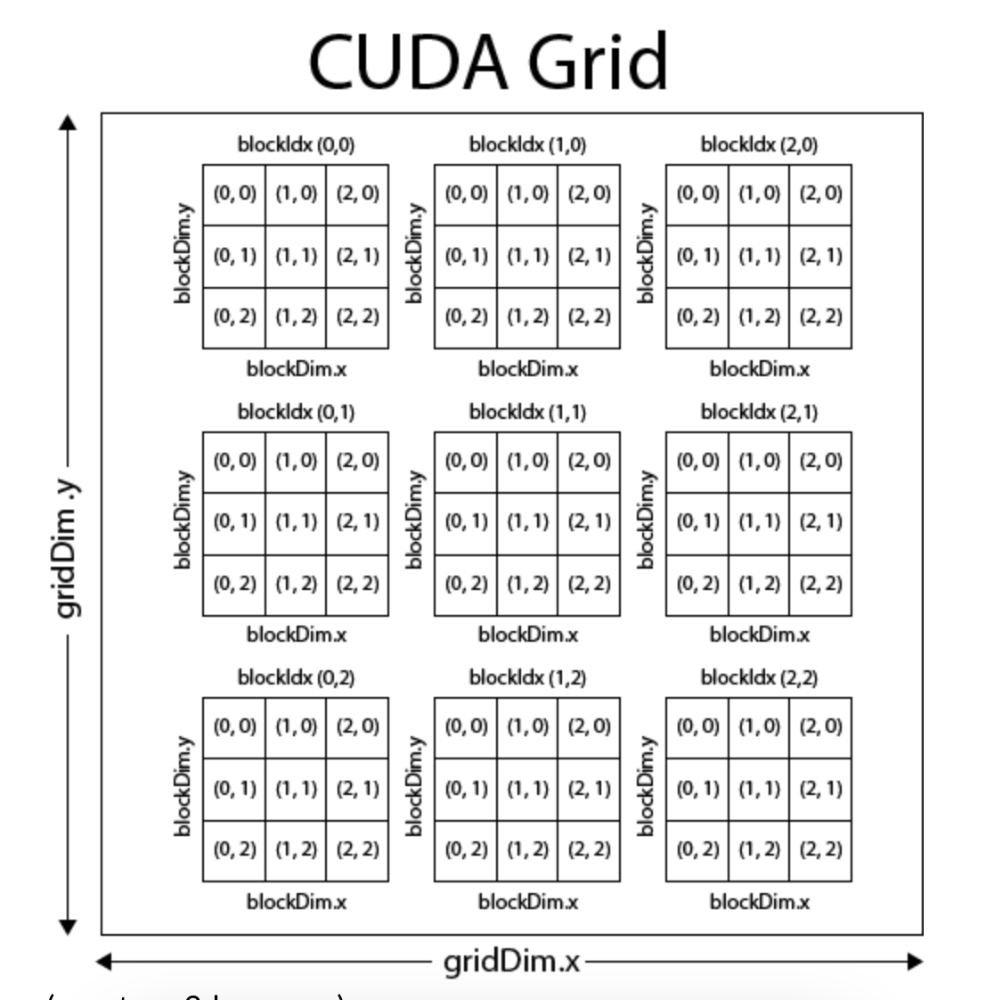
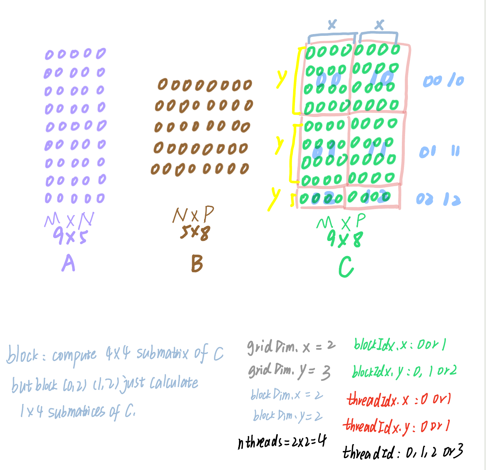
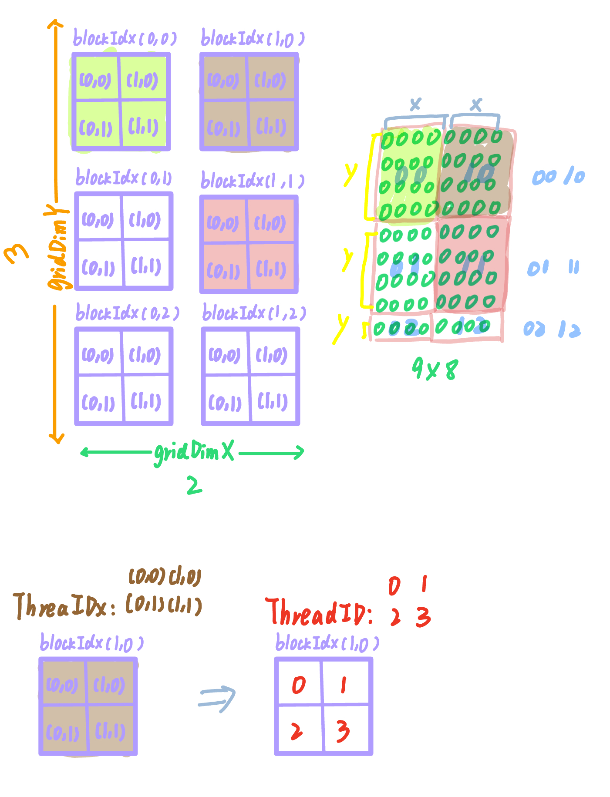
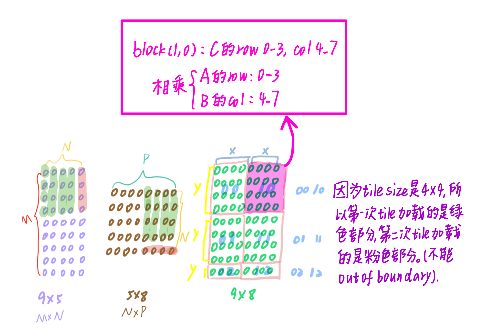
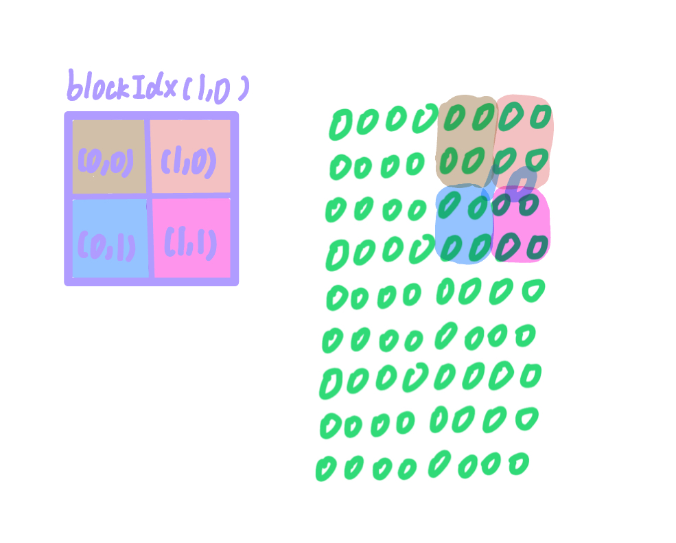

## Part 9: CUDA Backend - Matrix multiplication
  
Implement the following functions in `ndarray_backend_cuda.cu`:

* `Matmul()`

  
Finally, as your final exercise, you'll implement matrix multiplication on the GPU. Your implementation here can roughly follow the presentation in class. While you can pass the tests using fairly naive code here (i.e., you could just have a separate thread for each (i,j) location in the matrix, doing the matrix multiplication efficiently (to make it actually faster than a CPU version) requires cooperative fetching and the block shared memory register tiling covered in class. Try to implement using these methods, and see how much faster you can get your code than the C++ (or numpy) backends.


The Pseudocode in Class

```cpp
__global__ void mm(float A[N][N], float B[N][N], float C[N][N]) {
    __shared__ float sA[S][L], sB[S][L];
    float c[V][V] = {0};
    float a[V], b[V];
    int yblock = blockIdx.y;
    int xblock = blockIdx.x;

    for (int ko = 0; ko < N; ko += S) {
        __syncthreads();
        // needs to be implemented by thread cooperative fetching
        sA[:, :] = A[ko + S, yblock * L : yblock * L + L];
        sB[:, :] = B[ko + S, xblock * L : xblock * L + L];
        __syncthreads();

        for (int ki = 0; ki < S; ++ki) {
            a[:] = sA[ki, threadIdx.x * V + V];
            b[:] = sB[ki, threadIdx.x * V + V];
            for (int y = 0; y < V; ++y) {
                for (int x = 0; x < V; ++x) {
                    c[y][x] += a[y] * b[x];
                }
            }
        }
    }

    int ybase = blockIdx.y * blockDim.y + threadIdx.y;
    int xbase = blockIdx.x * blockDim.x + threadIdx.x;
    C[ybase * V : ybase * V + V, xbase * V : xbase * V + V] = c[:, :];
}
```


**Code Implementation**
```cpp
__global__ void MatmulKernel(const scalar_t* a, const scalar_t* b, scalar_t* c, uint32_t M, uint32_t N, uint32_t P) {
#define V 2

  // Get block and thread indices
  int block_x = blockIdx.x;  // Now block_x corresponds to columns of C (P)
  int block_y = blockIdx.y;  // Now block_y corresponds to rows of C (M)
  int thread_x = threadIdx.x;
  int thread_y = threadIdx.y;
  int thread_id = thread_x + thread_y * blockDim.x;
  int nthreads = blockDim.x * blockDim.y;

  // Shared memory for sub-matrices (tiles) of A and B
  __shared__ scalar_t a_shared[TILE][TILE];
  __shared__ scalar_t b_shared[TILE][TILE];

  // Registers for sub-block calculations
  scalar_t c_reg[V][V] = {0};  // Initialize output sub-block
  scalar_t a_reg[V] = {0};     // Temporary storage for row data from A
  scalar_t b_reg[V] = {0};     // Temporary storage for column data from B

  // Iterate over tiles of A and B
  for (int start = 0; start < N; start += TILE) {
    __syncthreads(); // Ensure all threads in the block finish the previous loop

    // Load tiles of A and B into shared memory, each thread loads one or more elements
    for (int idx = thread_id; idx < TILE * TILE; idx += nthreads) {
      int x = idx / TILE;  // Row index in the shared memory tile
      int y = idx % TILE;  // Column index in the shared memory tile

      // Load A tile from global memory to shared memory
      if (x + block_y * TILE < M && y + start < N) { // block_y now corresponds to rows of C
        a_shared[x][y] = a[(x + block_y * TILE) * N + y + start];  // Access elements of A using block_y for rows
      } else {
        a_shared[x][y] = 0.0f; // Out of bounds, set to 0
      }

      // Load B tile from global memory to shared memory
      if (x + start < N && y + block_x * TILE < P) { // block_x now corresponds to columns of C
        b_shared[x][y] = b[(x + start) * P + y + block_x * TILE];  // Access elements of B using block_x for columns
      } else {
        b_shared[x][y] = 0.0f; // Out of bounds, set to 0
      }
    }

    __syncthreads(); // Ensure all threads finish loading data to shared memory

    // Perform matrix multiplication on the loaded tiles
    int stripe_cnt = min(TILE, N - start); // Ensure we don't exceed matrix boundaries
    for (int stripe_i = 0; stripe_i < stripe_cnt; ++stripe_i) {
      if (thread_x * V < TILE && thread_y * V < TILE) {
        // Load row of A into registers for the current stripe (now thread_y controls row)
        for (int reg_x = 0; reg_x < V; ++reg_x) {
          int shared_x = thread_y * V + reg_x;  // Use thread_y for row control
          if (shared_x < TILE) {
            a_reg[reg_x] = a_shared[shared_x][stripe_i];
          }
        }

        // Load column of B into registers for the current stripe (now thread_x controls column)
        for (int reg_y = 0; reg_y < V; ++reg_y) {
          int shared_y = thread_x * V + reg_y;  // Use thread_x for column control
          if (shared_y < TILE) {
            b_reg[reg_y] = b_shared[stripe_i][shared_y];
          }
        }

        // Compute the outer product and accumulate results in c_reg
        for (int i = 0; i < V; ++i) {
          for (int j = 0; j < V; ++j) {
            c_reg[i][j] += a_reg[i] * b_reg[j];
          }
        }
      }
    }

    __syncthreads(); // Ensure all threads finish computations for this tile
  }

  // Store the computed 2x2 sub-block from c_reg into global memory
  if (thread_x * V < TILE && thread_y * V < TILE) {
    for (int i = 0; i < V; ++i) {
      for (int j = 0; j < V; ++j) {
        int x = block_y * TILE + thread_y * V + i; // Now thread_y controls row index
        int y = block_x * TILE + thread_x * V + j; // Now thread_x controls column index
        if (x < M && y < P) {
          c[x * P + y] = c_reg[i][j];  // Store result in the output matrix
        }
      }
    }
  }
}

void Matmul(const CudaArray& a, const CudaArray& b, CudaArray* out, uint32_t M, uint32_t N,
            uint32_t P) {
  /**
   * Multiply two (compact) matrices into an output (also comapct) matrix.  You will want to look
   * at the lecture and notes on GPU-based linear algebra to see how to do this.  Since ultimately
   * mugrade is just evaluating correctness, you _can_ implement a version that simply parallelizes
   * over (i,j) entries in the output array.  However, to really get the full benefit of this
   * problem, we would encourage you to use cooperative fetching, shared memory register tiling, 
   * and other ideas covered in the class notes.  Note that unlike the tiled matmul function in
   * the CPU backend, here you should implement a single function that works across all size
   * matrices, whether or not they are a multiple of a tile size.  As with previous CUDA
   * implementations, this function here will largely just set up the kernel call, and you should
   * implement the logic in a separate MatmulKernel() call.
   * 
   *
   * Args:
   *   a: compact 2D array of size m x n
   *   b: comapct 2D array of size n x p
   *   out: compact 2D array of size m x p to write the output to
   *   M: rows of a / out
   *   N: columns of a / rows of b
   *   P: columns of b / out
   */

  /// BEGIN SOLUTION
  dim3 grid_dim = dim3((P + TILE - 1) / TILE, (M + TILE - 1) / TILE, 1);
  dim3 block_dim = dim3(2, 2, 1);
  MatmulKernel<<<grid_dim, block_dim>>>(a.ptr, b.ptr, out->ptr, M, N, P);
	
  /// END SOLUTION
}
```


### Explain Kernel Launch:

When you call `Matmul`, it launches the CUDA kernel `MatmulKernel` with a **grid of blocks**, where each block contains a **2D array of threads**.  The `MatmulKernel` function is **not** called for just a single thread (e.g., with `threadIdx.x = 0`, `threadIdx.y = 0`). It’s called for **all threads** in all blocks simultaneously, and each thread operates on its own portion of the matrices `A`, `B`, and `C`. This parallel execution is what makes CUDA so powerful for matrix multiplication and other large-scale tasks.


### Explain `thread_id = thread_x + thread_y * blockDim.x`



#### Visualization Example:

Let’s consider a block of size `blockDim.x = 4` and `blockDim.y = 3`. This gives us a 2D grid of threads in a block like this:

```css
(0,0)  (1,0)  (2,0)  (3,0)
(0,1)  (1,1)  (2,1)  (3,1)
(0,2)  (1,2)  (2,2)  (3,2)
```


In this example:

- `blockDim.x = 4` (4 threads along the x-axis, i.e., columns)
- `blockDim.y = 3` (3 threads along the y-axis, i.e., rows)

Now, let’s compute the linear thread IDs for all the threads using the formula `thread_id = thread_x + thread_y * blockDim.x`:

| `thread_x` | `thread_y` | Computation (x + y * blockDim.x) | `thread_id` |
|------------|------------|-----------------------------------|-------------|
| 0          | 0          | 0 + 0 * 4 = 0                    | 0           |
| 1          | 0          | 1 + 0 * 4 = 1                    | 1           |
| 2          | 0          | 2 + 0 * 4 = 2                    | 2           |
| 3          | 0          | 3 + 0 * 4 = 3                    | 3           |
| 0          | 1          | 0 + 1 * 4 = 4                    | 4           |
| 1          | 1          | 1 + 1 * 4 = 5                    | 5           |
| 2          | 1          | 2 + 1 * 4 = 6                    | 6           |
| 3          | 1          | 3 + 1 * 4 = 7                    | 7           |
| 0          | 2          | 0 + 2 * 4 = 8                    | 8           |
| 1          | 2          | 1 + 2 * 4 = 9                    | 9           |
| 2          | 2          | 2 + 2 * 4 = 10                   | 10          |
| 3          | 2          | 3 + 2 * 4 = 11                   | 11          |

As we can see, the threads are indexed in a row-major order. The linear thread IDs start from `0` at `(0, 0)` and increment across the **x-axis** first (the row), before moving to the next row along the **y-axis**.

**Another Example**
Let’s visualize the full grid of blocks and the `thread_id`s within each block:
```css
Grid (2x2 blocks):
+-----------------------+-----------------------+
| Block 0 (thread_id)    | Block 1 (thread_id)   |
| +---+---+---+          | +---+---+---+         |
| | 0 | 1 | 2 |          | | 0 | 1 | 2 |         |
| +---+---+---+          | +---+---+---+         |
| | 3 | 4 | 5 |          | | 3 | 4 | 5 |         |
| +---+---+---+          | +---+---+---+         |
+-----------------------+-----------------------+
| Block 2 (thread_id)    | Block 3 (thread_id)   |
| +---+---+---+          | +---+---+---+         |
| | 0 | 1 | 2 |          | | 0 | 1 | 2 |         |
| +---+---+---+          | +---+---+---+         |
| | 3 | 4 | 5 |          | | 3 | 4 | 5 |         |
| +---+---+---+          | +---+---+---+         |
+-----------------------+-----------------------+
```
### Explain Shared memory

**Shared memory** in CUDA is a type of on-chip memory that is shared among all the threads within a block. It is a key component for optimizing performance on the GPU because it is much faster than **global memory** (which is off-chip and has higher latency). Shared memory can be used by threads within the same block to communicate and share data efficiently during computations.

### Explain `__shared__ scalar_t a_shared[TILE][TILE];`

In CUDA, `__shared__` is used to declare **shared memory**, a special type of memory that is shared by all threads within a **block**. Shared memory is much faster to access than global memory because it resides on the chip (GPU), and it can be accessed by all threads in the block. This makes it an excellent choice for storing intermediate data that is frequently accessed and updated by multiple threads within the same block.
```cpp
__shared__ scalar_t a_shared[TILE][TILE];
```

This line declares a 2D array named `a_shared` in **shared memory**:

-   `scalar_t`: This is the data type of the elements in the array. 
-   `TILE`: This is a predefined size (for example, `TILE = 4`). The array size is `TILE x TILE`, meaning it is a 2D square matrix.

In matrix multiplication, `a_shared` is used to temporarily store a tile (a small sub-matrix) of the matrix `A` in **shared memory** for use by all threads in the block.

### Explain cooperative fetching

Cooperative fetching means that the threads within a block work together to load multiple elements of data into shared memory, instead of each thread fetching just one element from global memory. This technique allows the threads to collectively reduce the number of slow global memory accesses and improve the performance by using the faster shared memory.


In the `MatmulKernel` implementation, cooperative fetching occurs when threads load tiles (sub-matrices) of matrices **A** and **B** into shared memory. Instead of each thread loading a single element from global memory (which would result in many slow memory accesses), the threads cooperatively fetch multiple elements in parallel and store them in shared memory for quicker access.

For example, in a 16x16 tile:

-   Without cooperative fetching, 256 independent global memory accesses would be required.
-   With cooperative fetching, 16 threads can load multiple elements at once, significantly reducing the number of memory accesses.

**Example**
```css
Tile (4x4):

|  0   |  1   |  2   |  3   |
|  4   |  5   |  6   |  7   |
|  8   |  9   | 10   | 11   |
| 12   | 13   | 14   | 15   |

Thread 0 (thread_id = 0) loads elements: 0, 4, 8, 12
Thread 1 (thread_id = 1) loads elements: 1, 5, 9, 13
Thread 2 (thread_id = 2) loads elements: 2, 6, 10, 14
Thread 3 (thread_id = 3) loads elements: 3, 7, 11, 15
```


### Explain Register Tiling

**Register tiling** is a technique used in GPU programming to maximize the use of the fastest memory available: **registers**. Registers are small, but extremely fast, storage locations that are private to each thread. Each thread uses its own set of registers during execution, allowing for quick access to frequently used data and reducing the need to access slower memory types like shared or global memory.

#### Example in Matrix Multiplication

In `MatmulKernel`, register tiling is implemented to optimize matrix multiplication by minimizing memory accesses and leveraging the fast registers within each thread.

Consider matrix multiplication using **register tiling** in this kernel:

-   **Without Register Tiling**: Each thread would need to repeatedly load individual elements from shared memory or global memory for every computation, which would lead to higher latency due to slower memory access.
    
-   **With Register Tiling**:
    
    1.  **Loading from Shared Memory into Registers**: Each thread in the block loads a small **portion** (or stripe) of the **shared memory tile** of matrix **A** (`a_shared`) and matrix **B** (`b_shared`) into its local registers (`a_reg[V]` and `b_reg[V]`), as shown in the code:
 
```cpp
scalar_t a_reg[V] = {0};     // Temporary storage for row data from A
scalar_t b_reg[V] = {0};     // Temporary storage for column data from B
```
```cpp
for (int reg_x = 0; reg_x < V; ++reg_x) {
          int shared_x = thread_y * V + reg_x;  // Use thread_y for row control
          if (shared_x < TILE) {
            a_reg[reg_x] = a_shared[shared_x][stripe_i];
          }
        }
     
for (int reg_y = 0; reg_y < V; ++reg_y) {
          int shared_y = thread_x * V + reg_y;  // Use thread_x for column control
          if (shared_y < TILE) {
            b_reg[reg_y] = b_shared[stripe_i][shared_y];
          }
        }
```
    
  2. Once the small tiles are loaded into registers, the thread computes the **outer product** of these two tiles (a sub-block of the result matrix **C**) and stores the intermediate result in its local registers (`c_reg[V][V]`). (**`c_reg[V][V]`**: This register tile stores the partial results of the matrix multiplication. Each thread maintains a 2x2 block (`V = 2`) in its registers (`c_reg`), accumulating the results of the matrix multiplication for a small sub-block of matrix **C**).
```cpp
scalar_t c_reg[V][V] = {0};  // Initialize output sub-block
```
```cpp
for (int i = 0; i < V; ++i) {
       for (int j = 0; j < V; ++j) {
         c_reg[i][j] += a_reg[i] * b_reg[j];
       }
     }
```


   3. After the computation for that tile is completed, the results from the registers are written back to the global memory to update the output matrix **C**:

```cpp
if (thread_x * V < TILE && thread_y * V < TILE) {
    for (int i = 0; i < V; ++i) {
      for (int j = 0; j < V; ++j) {
        int x = block_y * TILE + thread_y * V + i; // Now thread_y controls row index
        int y = block_x * TILE + thread_x * V + j; // Now thread_x controls column index
        if (x < M && y < P) {
          c[x * P + y] = c_reg[i][j];  // Store result in the output matrix
        }
      }
    }
  }
```

### Explain Load tiles of A and B into shared memory

```cpp
  // Iterate over tiles of A and B
  for (int start = 0; start < N; start += TILE) {
    __syncthreads(); // Ensure all threads in the block finish the previous loop

    // Load tiles of A and B into shared memory, each thread loads one or more elements
    for (int idx = thread_id; idx < TILE * TILE; idx += nthreads) {
      int x = idx / TILE;  // Row index in the shared memory tile
      int y = idx % TILE;  // Column index in the shared memory tile

      // Load A tile from global memory to shared memory
      if (x + block_y * TILE < M && y + start < N) { // block_y now corresponds to rows of C
        a_shared[x][y] = a[(x + block_y * TILE) * N + y + start];  // Access elements of A using block_y for rows
      } else {
        a_shared[x][y] = 0.0f; // Out of bounds, set to 0
      }

      // Load B tile from global memory to shared memory
      if (x + start < N && y + block_x * TILE < P) { // block_x now corresponds to columns of C
        b_shared[x][y] = b[(x + start) * P + y + block_x * TILE];  // Access elements of B using block_x for columns
      } else {
        b_shared[x][y] = 0.0f; // Out of bounds, set to 0
      }
    }

    __syncthreads(); // Ensure all threads finish loading data to shared memory
  }
```
Convert to python to illustrate it:

```python
import numpy as np

def matmul_tile(a, b, M, N, P, block_x, block_y, thread_x, thread_y, thread_id, nthreads, TILE=4, V=2):

    # Initialize the output matrix c
    c = np.zeros((M, P), dtype=a.dtype)

    # Shared memory equivalent (tiles of A and B)
    a_shared = np.zeros((TILE, TILE), dtype=a.dtype)
    b_shared = np.zeros((TILE, TILE), dtype=b.dtype)

    # Iterate over tiles of A and B
    for start in range(0, N, TILE):
        # Load tiles of A and B into shared memory
        for idx in range(thread_id, TILE * TILE, nthreads):
            x = idx // TILE  # Row index in the shared memory tile
            y = idx % TILE   # Column index in the shared memory tile

            # Load A tile from global memory to shared memory
            if x + block_y * TILE < M and y + start < N:
                a_shared[x, y] = a[(x + block_y * TILE), (y + start)]
                print(f"a_shared[{x}, {y}] corresponds to a[{x + block_y * TILE}, {y + start}]")
            else:
                a_shared[x, y] = 0.0  # Out of bounds, set to 0

            # Load B tile from global memory to shared memory
            if x + start < N and y + block_x * TILE < P:
                b_shared[x, y] = b[(x + start), (y + block_x * TILE)]
                # print(f"b_shared[{x}, {y}] corresponds to b[{x + start}, {y + block_x * TILE}]")
            else:
                b_shared[x, y] = 0.0  # Out of bounds, set to 0

if __name__ == "__main__":
    # Example usage:
    M, N, P = 9, 5, 8
    a = np.random.rand(M, N).astype(np.float32)
    b = np.random.rand(N, P).astype(np.float32)

    # Parameters for thread and block indexing
    block_x, block_y = 1, 0
    blockDim_x = 2
    blockDim_y = 2
    thread_x, thread_y = 0, 0
    thread_id = thread_x + thread_y * blockDim_x  # Assuming 2 threads per dimension
    nthreads = blockDim_x * blockDim_y

    matmul_tile(a, b, M, N, P, block_x=block_x, block_y=block_y, thread_x=thread_x, thread_y=thread_y, thread_id=thread_id, nthreads=nthreads)
    # print(c)
```
```css
block_x, block_y = 1, 0
blockDim_x = 2
blockDim_y = 2
For thread_x, thread_y = 0, 0 thread_id = 0
a_shared[0, 0] corresponds to a[0, 0]
a_shared[1, 0] corresponds to a[1, 0]
a_shared[2, 0] corresponds to a[2, 0]
a_shared[3, 0] corresponds to a[3, 0]
a_shared[0, 0] corresponds to a[0, 4]
a_shared[1, 0] corresponds to a[1, 4]
a_shared[2, 0] corresponds to a[2, 4]
a_shared[3, 0] corresponds to a[3, 4]

b_shared[0, 0] corresponds to b[0, 4]
b_shared[1, 0] corresponds to b[1, 4]
b_shared[2, 0] corresponds to b[2, 4]
b_shared[3, 0] corresponds to b[3, 4]
b_shared[0, 0] corresponds to b[4, 4]
```

```css
block_x, block_y = 1, 0
blockDim_x = 2
blockDim_y = 2
For thread_x, thread_y = 1, 0 thread_id = 1
a_shared[0, 1] corresponds to a[0, 1]
a_shared[1, 1] corresponds to a[1, 1]
a_shared[2, 1] corresponds to a[2, 1]
a_shared[3, 1] corresponds to a[3, 1]

b_shared[0, 1] corresponds to b[0, 5]
b_shared[1, 1] corresponds to b[1, 5]
b_shared[2, 1] corresponds to b[2, 5]
b_shared[3, 1] corresponds to b[3, 5]
b_shared[0, 1] corresponds to b[4, 5]
```
```css
block_x, block_y = 1, 0
blockDim_x = 2
blockDim_y = 2
For thread_x, thread_y = 0, 1 thread_id = 2
a_shared[0, 2] corresponds to a[0, 2]
a_shared[1, 2] corresponds to a[1, 2]
a_shared[2, 2] corresponds to a[2, 2]
a_shared[3, 2] corresponds to a[3, 2]

b_shared[0, 2] corresponds to b[0, 6]
b_shared[1, 2] corresponds to b[1, 6]
b_shared[2, 2] corresponds to b[2, 6]
b_shared[3, 2] corresponds to b[3, 6]
b_shared[0, 2] corresponds to b[4, 6]
```
```css
block_x, block_y = 1, 0
blockDim_x = 2
blockDim_y = 2
For thread_x, thread_y = 1, 1 thread_id = 3
a_shared[0, 3] corresponds to a[0, 3]
a_shared[1, 3] corresponds to a[1, 3]
a_shared[2, 3] corresponds to a[2, 3]
a_shared[3, 3] corresponds to a[3, 3]

b_shared[0, 3] corresponds to b[0, 7]
b_shared[1, 3] corresponds to b[1, 7]
b_shared[2, 3] corresponds to b[2, 7]
b_shared[3, 3] corresponds to b[3, 7]
b_shared[0, 3] corresponds to b[4, 7]
```
**Visualization:**



In this example, matrix **A** is of size 9x5 (**M = 9**, **N = 5**), matrix **B** is 5x8 (**N = 5**, **P = 8**), and the resulting matrix **C** is 9x8 (**M = 9**, **P = 8**)



In this example, the grid dimensions are `griddim.x = 2` and `griddim.y = 3`, while the block dimensions are `blockDim.x = 2` and `blockDim.y = 2`, giving a total of `nthreads = blockDim.x * blockDim.y = 4` threads per block. Each block is assigned to compute a portion of the output matrix **C**, with `blockIdx.x = 0 or 1`, `blockIdx.y = 0, 1, or 2`, and `threadIdx.x = 0 or 1` and `threadIdx.y = 0 or 1`, corresponding to `threadId = 0, 1, 2, or 3`.

Each block computes a 4x4 submatrix of **C**, but blocks `(0,2)` and `(1,2)` only compute 1x4 submatrices due to the matrix boundaries. For instance, the green block (with `blockIdx(0,0)`) calculates the rows 0–3 and columns 0–3 of **C**, while the brown block (with `blockIdx(1,0)`) computes rows 0–3 and columns 4–7.

The image also illustrates the thread IDs: 
- `threadIdx(0,0)` corresponds to `threadId 0`
- `threadIdx(1,0)` corresponds to `threadId 1`
- `threadIdx(0,1)` corresponds to `threadId 2`
- `threadIdx(1,1)` corresponds to `threadId 3`




Since block (1, 0) is responsible for calculating the top-right portion of the output matrix **C**, which corresponds to rows 0–3 of matrix **A** multiplied by columns 4–7 of matrix **B**, the relevant parts of these matrices are loaded into shared memory as tiles for efficient processing.

The green-colored matrices correspond to the first iteration of the loop `for (int start = 0; start < N; start += TILE)` when `start = 0`, representing the first tile being loaded. In this case, both tiles from matrices **A** and **B** have a shape of `TILE x TILE`. The pink-colored matrices correspond to the second iteration, when `start = 4`. Here, the shapes are `4x1` for matrix **A** and `1x4` for matrix **B**, since this iteration processes the remaining row and column elements that do not form a full `4x4` tile. Since we need to load the entire row and column, but the total column count **N** is 5 (greater than the tile size of 4), we must load the data in two separate steps.

### Explain Stripe

A **stripe** represents part of the current tile of matrix **A** and **B** being loaded and multiplied. Each stripe can be thought of as a small slice of a row from **A** and a corresponding slice of a column from **B**.

### Explain Perform matrix multiplication on the loaded tiles

```cpp
 // Iterate over tiles of A and B
  for (int start = 0; start < N; start += TILE) {
    __syncthreads(); // Ensure all threads in the block finish the previous loop

    // Perform matrix multiplication on the loaded tiles
    int stripe_cnt = min(TILE, N - start); // Ensure we don't exceed matrix boundaries
    for (int stripe_i = 0; stripe_i < stripe_cnt; ++stripe_i) {
      if (thread_x * V < TILE && thread_y * V < TILE) {
        // Load row of A into registers for the current stripe (now thread_y controls row)
        for (int reg_x = 0; reg_x < V; ++reg_x) {
          int shared_x = thread_y * V + reg_x;  // Use thread_y for row control
          if (shared_x < TILE) {
            a_reg[reg_x] = a_shared[shared_x][stripe_i];
          }
        }

        // Load column of B into registers for the current stripe (now thread_x controls column)
        for (int reg_y = 0; reg_y < V; ++reg_y) {
          int shared_y = thread_x * V + reg_y;  // Use thread_x for column control
          if (shared_y < TILE) {
            b_reg[reg_y] = b_shared[stripe_i][shared_y];
          }
        }

        // Compute the outer product and accumulate results in c_reg
        for (int i = 0; i < V; ++i) {
          for (int j = 0; j < V; ++j) {
            c_reg[i][j] += a_reg[i] * b_reg[j];
          }
        }
      }
    }

    __syncthreads(); // Ensure all threads finish computations for this tile
  }
```
Convert to python to illustrate it:

```python
TILE = 4
N = 5
start = 0
stripe_cnt = min(TILE, N - start)
thread_x = 1  # This will now control the column index
thread_y = 0  # This will now control the row index
V = 2

# Initialize the shared memory for matrices A and B (for demonstration, these are 4x4 matrices)
a_shared = [[0 for _ in range(TILE)] for _ in range(TILE)]
b_shared = [[0 for _ in range(TILE)] for _ in range(TILE)]

# Initialize registers
a_reg = [0 for _ in range(V)]
b_reg = [0 for _ in range(V)]

# Initialize the output register (c_reg), which is a 2x2 block
c_reg = [[0 for _ in range(V)] for _ in range(V)]

# Loop over stripes
for stripe_i in range(stripe_cnt):
    if thread_x * V < TILE and thread_y * V < TILE:
        # Load row of A into registers for the current stripe (use thread_y for row index)
        for reg_x in range(V):
            shared_x = thread_y * V + reg_x  # Use thread_y for row control
            if shared_x < TILE:
                a_reg[reg_x] = a_shared[shared_x][stripe_i]
                # For demonstration, let's print the values being loaded
                print(f"Loaded a_shared[{shared_x}][{stripe_i}] into a_reg[{reg_x}]")

        # Load column of B into registers for the current stripe (use thread_x for column index)
        for reg_y in range(V):
            shared_y = thread_x * V + reg_y  # Use thread_x for column control
            if shared_y < TILE:
                b_reg[reg_y] = b_shared[stripe_i][shared_y]
                # For demonstration, let's print the values being loaded
                print(f"Loaded b_shared[{stripe_i}][{shared_y}] into b_reg[{reg_y}]")

        # Compute the outer product and accumulate results in c_reg
        for i in range(V):
            for j in range(V):
                c_reg[i][j] += a_reg[i] * b_reg[j]
                # For demonstration, print the computation details
                print(f"c_reg[{i}][{j}] += a_reg[{i}] * b_reg[{j}] => {c_reg[i][j]}")

# For demonstration, output the final c_reg values
print("Final c_reg values:")
for row in c_reg:
    print(row)
```
```css
Loaded a_shared[0][0] into a_reg[0]
Loaded a_shared[1][0] into a_reg[1]
Loaded b_shared[0][2] into b_reg[0]
Loaded b_shared[0][3] into b_reg[1]
c_reg[0][0] += a_reg[0] * b_reg[0] => 0
c_reg[0][1] += a_reg[0] * b_reg[1] => 0
c_reg[1][0] += a_reg[1] * b_reg[0] => 0
c_reg[1][1] += a_reg[1] * b_reg[1] => 0
Loaded a_shared[0][1] into a_reg[0]
Loaded a_shared[1][1] into a_reg[1]
Loaded b_shared[1][2] into b_reg[0]
Loaded b_shared[1][3] into b_reg[1]
c_reg[0][0] += a_reg[0] * b_reg[0] => 0
c_reg[0][1] += a_reg[0] * b_reg[1] => 0
c_reg[1][0] += a_reg[1] * b_reg[0] => 0
c_reg[1][1] += a_reg[1] * b_reg[1] => 0
Loaded a_shared[0][2] into a_reg[0]
Loaded a_shared[1][2] into a_reg[1]
Loaded b_shared[2][2] into b_reg[0]
Loaded b_shared[2][3] into b_reg[1]
c_reg[0][0] += a_reg[0] * b_reg[0] => 0
c_reg[0][1] += a_reg[0] * b_reg[1] => 0
c_reg[1][0] += a_reg[1] * b_reg[0] => 0
c_reg[1][1] += a_reg[1] * b_reg[1] => 0
Loaded a_shared[0][3] into a_reg[0]
Loaded a_shared[1][3] into a_reg[1]
Loaded b_shared[3][2] into b_reg[0]
Loaded b_shared[3][3] into b_reg[1]
c_reg[0][0] += a_reg[0] * b_reg[0] => 0
c_reg[0][1] += a_reg[0] * b_reg[1] => 0
c_reg[1][0] += a_reg[1] * b_reg[0] => 0
c_reg[1][1] += a_reg[1] * b_reg[1] => 0
Final c_reg values:
[0, 0]
[0, 0]
```

Each thread has its own registers, so while multiple threads load values into `c_reg[0][0]`, `c_reg[0][1]`, `c_reg[1][0]`, and `c_reg[1][1]`, these are separate and stored in each thread's local registers. Each thread computes a 2x2 submatrix of **C**, while the block computes a 4x4 tile. This parallelism distributes the work efficiently across threads within the block.

**Visualization**:



In `blockIdx(1,0)`, each thread within the block will compute a specific 2x2 submatrix of the assigned 4x4 portion of matrix **C**:

-   `threadIdx(0,0)` computes the top-left 2x2 submatrix,
-   `threadIdx(1,0)` computes the top-right 2x2 submatrix,
-   `threadIdx(0,1)` computes the bottom-left 2x2 submatrix,
-   `threadIdx(1,1)` computes the bottom-right 2x2 submatrix.

For example, in `threadIdx(1,0)`, it will calculate the row 0 of **A** multiplied by column 6 of **B** to compute the value at position (0,6) in matrix **C**."

### Explain Store the computed 2x2 sub-block from c_reg into global memory

```cpp
// Store the computed 2x2 sub-block from c_reg into global memory
  if (thread_x * V < TILE && thread_y * V < TILE) {
    for (int i = 0; i < V; ++i) {
      for (int j = 0; j < V; ++j) {
        int x = block_y * TILE + thread_y * V + i; // Now thread_y controls row index
        int y = block_x * TILE + thread_x * V + j; // Now thread_x controls column index
        if (x < M && y < P) {
          c[x * P + y] = c_reg[i][j];  // Store result in the output matrix
        }
      }
    }
  }
```

```python
# Define necessary variables
TILE = 4
V = 2
M = 9  # Number of rows in matrix C
P = 8  # Number of columns in matrix C

block_x = 1  # Example block column index
block_y = 0  # Example block row index

thread_x = 1  # Example thread column index in block (controls columns)
thread_y = 0  # Example thread row index in block (controls rows)

# Initialize c_reg (2x2 matrix for each thread)
c_reg = [[0 for _ in range(V)] for _ in range(V)]

# Initialize the global memory matrix 'c' with zeros (M x P)
c = [[0 for _ in range(P)] for _ in range(M)]

# Loop over the elements of the 2x2 block
for i in range(V):
    for j in range(V):
        # Calculate global indices (x and y) in matrix C
        x = block_y * TILE + thread_y * V + i  # Row index in C (now controlled by thread_y)
        y = block_x * TILE + thread_x * V + j  # Column index in C (now controlled by thread_x)

        # Check for out-of-bounds and write to matrix C if valid
        if x < M and y < P:
            c[x][y] = c_reg[i][j]  # Store the result in the global matrix C
            print(f"Loaded c_reg[{i}][{j}] into c[{x}][{y}]")
```
```css
Loaded c_reg[0][0] into c[0][6]
Loaded c_reg[0][1] into c[0][7]
Loaded c_reg[1][0] into c[1][6]
Loaded c_reg[1][1] into c[1][7]
```
