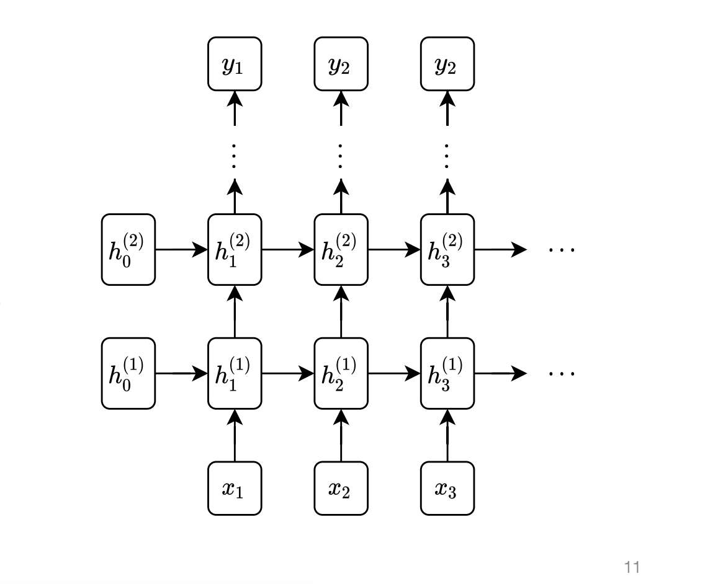

## Part 4: Recurrent neural network [10 points]

**Note:** In the following sections, you may find yourself wanting to index into tensors, i.e., to use getitem or setitem. However, we have not implemented these for tensors in our library; instead, you should use `stack` and `split` operations.

In `python/needle/nn_sequence.py`, implement `RNNCell`.

$h^\prime = \text{tanh}(xW_{ih} + b_{ih} + hW_{hh} + b_{hh})$. If nonlinearity is 'relu', then ReLU is used in place of tanh.
  
All weights and biases should be initialized from $\mathcal{U}(-\sqrt{k}, \sqrt{k})$ where $k=\frac{1}{\text{hiddensize}}$.

In `python/needle/nn_sequence.py`, implement `RNN`.

For each element in the input sequence, each layer computes the following function:

$h_t = \text{tanh}(x_tW_{ih} + b_{ih} + h_{(t-1)}W_{hh} + b_{hh})$

where $h_t$ is the hidden state at time $t$, $x_t$ is the input at time $t$, and $h_{(t-1)}$ is the hidden state of the previous layer at time $t-1$ or the initial hidden state at time $0$. If nonlinearity is 'relu', then ReLU is used in place of tanh.

In a multi-layer RNN, the input $x_t^{(l)}$ of the $l$-th layer ($l \ge 2$) is the hidden state $h_t^{(l-1)}$ of the previous layer.

___
### Stacking RNNs
Just like normal neural networks, RNNs can be stacked together, treating the hidden unit of one layer as the input to the next layer, to form “deep” RNNs. Practically speaking, tends to be less value in “very deep” RNNs than for other architectures

### Multi-layer RNN Example with Two Layers

For each layer in an RNN, the hidden state at time step $t$ depends not only on the input at time step $t$ but also on the hidden state from the previous time step $t-1$ for the same layer.

#### For Layer 1:
- **Input at time step $t$**: $x_t$
- **Previous hidden state from time step $t-1$ for Layer 1**: $h_{t-1}^{(1)}$

The hidden state for Layer 1 at time $t$, $h_t^{(1)}$, is computed using:

$$h_t^{(1)} = \text{RNN}(x_t, h_{t-1}^{(1)})$$

This means:
- The current hidden state $h_t^{(1)}$ for Layer 1 is based on the input at time $t$ and the hidden state from the previous time step $h_{t-1}^{(1)}$ from Layer 1.

#### For Layer 2:
- **Input to Layer 2 at time step $t$**: This is the hidden state $h_t^{(1)}$ from Layer 1 at time $t$.
- **Previous hidden state from time step $t-1$ for Layer 2**: $h_{t-1}^{(2)}$

The hidden state for Layer 2 at time $t$, $h_t^{(2)}$, is computed using:

$$h_t^{(2)} = \text{RNN}(h_t^{(1)}, h_{t-1}^{(2)})$$

This means:
- The current hidden state $h_t^{(2)}$ for Layer 2 depends on:
  - The hidden state $h_t^{(1)}$ from Layer 1 at the current time step $t$.
  - The previous hidden state $h_{t-1}^{(2)}$ from Layer 2 at the previous time step $t-1$.

#### Putting it Together for Two Time Steps:

##### Time Step $t$:
##### Layer 1:
- **Input**: $x_t$
- **Previous hidden state**: $h_{t-1}^{(1)}$
- **Hidden state calculation**:
$$h_t^{(1)} = \text{RNN}(x_t, h_{t-1}^{(1)})$$

##### Layer 2:
- **Input**: $h_t^{(1)}$ (output of Layer 1 at time $t$)
- **Previous hidden state**: $h_{t-1}^{(2)}$
- **Hidden state calculation**:

$$h_t^{(2)} = \text{RNN}(h_t^{(1)}, h_{t-1}^{(2)})$$

##### Time Step $t+1$:
##### Layer 1:
- **Input**: $x_{t+1}$
- **Previous hidden state**: $h_t^{(1)}$ (from time step $t$)
- **Hidden state calculation**:

$$h_{t+1}^{(1)} = \text{RNN}(x_{t+1}, h_t^{(1)})$$

##### Layer 2:
- **Input**: $h_{t+1}^{(1)}$ (output of Layer 1 at time $t+1$)
- **Previous hidden state**: $h_t^{(2)}$ (from time step $t$)
- **Hidden state calculation**:

$$h_{t+1}^{(2)} = \text{RNN}(h_{t+1}^{(1)}, h_t^{(2)})$$

#### Key Takeaway:
- Each layer in an RNN processes information sequentially over time steps:
  - For **Layer 1**, the input is the actual data sequence $x_t$, and the hidden state evolves over time based on the input and the previous hidden state.
  - For **Layer 2** (and any layer above Layer 1), the input is not the original sequence but rather the hidden state of the previous layer (Layer 1), combined with the previous hidden state from the same layer (Layer 2) from the prior time step.
  
The hidden states are continuously updated across both time steps and layers, creating a hierarchical structure where higher layers build on the temporal features learned by the lower layers.

### Computation Flow

-   The RNN processes **one time step at a time across all layers**. After it processes all layers for the current time step, it moves to the next time step.

#### Example Flow:

1.  **At time step 1**:
    
    -   First, compute $h_1^{(1)}$​ (hidden state for Layer 1 at time step 1).
    -   Then, compute $h_1^{(2)}$ (hidden state for Layer 2 at time step 1, based on $h_1^{(1)}$.
    -   If there are more layers, continue computing for higher layers at time step 1.
2.  **At time step 2**:
    
    -   Compute $h_2^{(1)}$​ (hidden state for Layer 1 at time step 2, based on $h_1^{(1)}$.
    -   Then, compute $h_2^{(2)}$​ (hidden state for Layer 2 at time step 2, based on $h_2^{(1)}$.
    -   Continue for additional layers at time step 2.

#### Sequence of Execution:

1.  Compute $h_1^{(1)}$ → $h_1^{(2)}$ (Layer 1 → Layer 2 at time step 1)
2.  Compute $h_2^{(1)}$ → $h_2^{(2)}$ (Layer 1 → Layer 2 at time step 2)
3.  Compute $h_3^{(1)}$ → $h_3^{(2)}$​ (Layer 1 → Layer 2 at time step 3)

### How RNN Cells Work Across Time Steps

For **Layer 2** (or any other layer), there's only **one** `RNNCell` per layer, but it processes the entire sequence one time step at a time. It maintains its own hidden state that gets updated as it processes each time step.

So, for Layer 2, the single `RNNCell` processes the hidden states for all time steps (e.g., $h_1^{(2)}, h_2^{(2)}, h_3^{(2)}$) sequentially as follows:

- At time step 1, it computes $h_1^{(2)}$.
- At time step 2, it computes $h_2^{(2)}$ based on the output of time step 1.
- At time step 3, it computes $h_3^{(2)}$ based on the output of time step 2.

The **same `RNNCell` object** is responsible for handling **all time steps** for the layer. It doesn't create new cells for each time step.

#### Why Only One `RNNCell` is Enough for a Layer:
- **Shared Parameters**: The parameters (weights and biases) of the `RNNCell` are shared across all time steps within the layer. This is what gives the RNN its ability to process sequences — it applies the same transformation (defined by the same `RNNCell`) to each time step, but with updated hidden states.
- **Sequential Processing**: The `RNNCell` processes the input sequence one time step at a time. Each time step’s output (the hidden state) becomes the input for the next time step.

#### Example for Layer 2:

##### At time step 1:

$$h_1^{(2)} = \text{RNNCell}(h_1^{(1)}, h_0^{(2)})$$

- Here, $h_1^{(1)}$ is the hidden state output from Layer 1 at time step 1.
- $h_0^{(2)}$ is the initial hidden state for Layer 2 at time step 0 (usually initialized to zero).

##### At time step 2:

$$h_2^{(2)} = \text{RNNCell}(h_2^{(1)}, h_1^{(2)})$$

- $h_2^{(1)}$ is the hidden state from Layer 1 at time step 2.
- $h_1^{(2)}$ is the hidden state of Layer 2 at time step 1 (calculated previously).

#### At time step 3:

$$h_3^{(2)} = \text{RNNCell}(h_3^{(1)}, h_2^{(2)})$$

- $h_3^{(1)}$ is the hidden state from Layer 1 at time step 3.
- $h_2^{(2)}$ is the hidden state of Layer 2 at time step 2 (calculated previously).

#### Conclusion:
-   **Weights and biases do not change** across time steps in a single forward pass through the sequence. They are learned during training (through backpropagation and gradient updates) but stay **constant** during the forward pass.
-   The **hidden states** are what change over time as the RNN processes each time step.
So for $h_2^{(2)}$​, it uses the **same weights** as were used for $h_1^{(2)}$​, but the hidden state $h_1^{(2)}$ is updated based on the previous step.

Only **one `RNNCell` per layer** is required, even if there are multiple time steps. The `RNNCell` processes the sequence step by step, updating its hidden state as it moves through time.

So, for Layer 2 (or any other layer), there is only **one `RNNCell`**, which processes the entire sequence, updating its hidden state at each time step.

### Explain of `output = ops.stack(X_input, 0)`

The line `output = ops.stack(X_input, 0)` stacks the outputs of the last layer (in this case, Layer 2) for all time steps. So, after the processing loop completes, **`X_input`** contains the outputs of the last layer at each time step.

#### Example:

If `seq_len = 3`, `batch_size = 2`, and `hidden_size = 5`, then the `output` tensor will contain:

$$\text{output} = [h_1^{(2)}, h_2^{(2)}, h_3^{(2)}]$$

### Explain of `h_n = ops.stack(h_input, 0)`

The line `h_n = ops.stack(h_input, 0)` stacks the **final hidden states** for each layer at the **last time step**.

#### Example:

If `num_layers = 2`, `batch_size = 2`, and `hidden_size = 5`, then:
$$h_n = [h_3^{(1)}, h_3^{(2)}]$$
