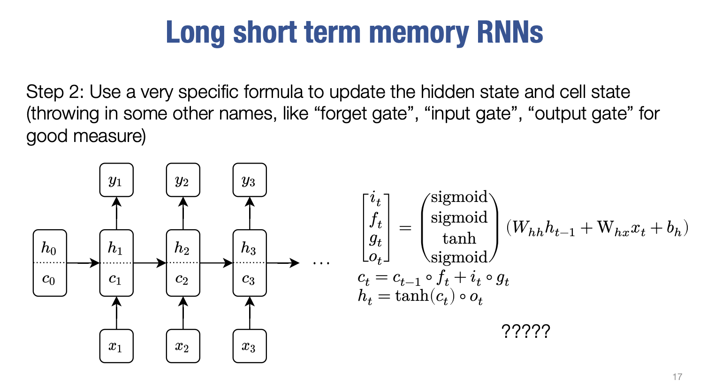

## Part 5: Long short-term memory network [10 points]

In `python/needle/nn/nn_sequence.py`, implement `Sigmoid`.

$\sigma(x) = \frac{1}{1 + \text{exp}(-x)}$

In `python/needle/nn/nn_sequence.py`, implement `LSTMCell`.

$$\begin{aligned}
i &= \sigma(xW_{ii} + b_{ii} + hW_{hi} + b_{hi}) \\
f &= \sigma(xW_{if} + b_{if} + hW_{hf} + b_{hf}) \\
g &= \tanh(xW_{ig} + b_{ig} + hW_{hg} + b_{hg}) \\
o &= \sigma(xW_{io} + b_{io} + hW_{ho} + b_{ho}) \\
c' &= f \cdot c + i \cdot g \\
h' &= o \cdot \tanh(c')
\end{aligned}$$

where $\sigma$ is the sigmoid function, and $i$, $f$, $g$, $o$ are the input, forget, cell, and output gates, respectively.

All weights and biases should be initialized from $\mathcal{U}(-\sqrt{k}, \sqrt{k})$ where $k=\frac{1}{\text{hiddensize}}$.

Now implement `LSTM` in `python/needle/nn/nn_sequence.py`, which applies a multi-layer LSTM RNN to an input sequence. For each element in the input sequence, each layer computes the following function:

$$\begin{aligned}
i_t &= \sigma(x_t W_{ii} + b_{ii} + h_{t-1} W_{hi} + b_{hi}) \\
f_t &= \sigma(x_t W_{if} + b_{if} + h_{t-1} W_{hf} + b_{hf}) \\
g_t &= \tanh(x_t W_{ig} + b_{ig} + h_{t-1} W_{hg} + b_{hg}) \\
o_t &= \sigma(x_t W_{io} + b_{io} + h_{t-1} W_{ho} + b_{ho}) \\
c_t &= f_t \cdot c_{t-1} + i_t \cdot g_t \\
h_t &= o_t \cdot \tanh(c_t)
\end{aligned}$$,

where $h_t$ is the hidden state at time $t$, $c_t$ is the cell state at time $t$, $x_t$ is the input at time $t$, $h_{(t-1)}$ is the hidden state of the layer at time $t-1$ or the initial hidden state at time $0$, and $i_t$, $f_t$, $g_t$, $o_t$ are the input, forget, cell, and output gates at time $t$ respectively.

In a multi-layer LSTM, the input $x_t^{(l)}$ of the $l$-th layer ($l \ge 2$) is the hidden state $h_t^{(l-1)}$ of the previous layer.

**Code Implementation**
```python
class LSTMCell(Module):
    def __init__(self, input_size, hidden_size, bias=True, device=None, dtype="float32"):
        super().__init__()
        ### BEGIN YOUR SOLUTION
        bound = 1.0 / np.sqrt(hidden_size)
        self.W_ih = Parameter(init.rand(input_size, 4*hidden_size, low=-bound, high=bound, device=device, dtype=dtype))
        self.W_hh = Parameter(init.rand(hidden_size, 4*hidden_size, low=-bound, high=bound, device=device, dtype=dtype))
        self.bias_ih = Parameter(init.rand(4*hidden_size, low=-bound, high=bound, device=device, dtype=dtype)) if bias else None
        self.bias_hh = Parameter(init.rand(4*hidden_size, low=-bound, high=bound, device=device, dtype=dtype)) if bias else None
        self.sigmoid = Sigmoid()
        ### END YOUR SOLUTION

    def forward(self, X, h=None):
        ### BEGIN YOUR SOLUTION
        bs = X.shape[0]
        hidden_size = self.W_hh.shape[0]
        if h is None:
            h0 = init.zeros(bs, hidden_size, device=X.device, dtype=X.dtype)
            c0 = init.zeros(bs, hidden_size, device=X.device, dtype=X.dtype)
        else:
            h0, c0 = h
        Z = X@self.W_ih + h0@self.W_hh # [bs, 4*hidden_size]
        if self.bias_ih:
            bias = self.bias_ih + self.bias_hh
            bias = bias.reshape((1, bias.shape[0]))
            bias = bias.broadcast_to(Z.shape)
            Z += bias
        stripes = list(ops.split(Z, 1))
        i = self.sigmoid(ops.stack(stripes[0: hidden_size], 1))
        f = self.sigmoid(ops.stack(stripes[hidden_size: 2*hidden_size], 1))
        g = ops.tanh(ops.stack(stripes[2*hidden_size: 3*hidden_size], 1))
        o = self.sigmoid(ops.stack(stripes[3*hidden_size: 4*hidden_size], 1))
        c = f * c0 + i * g
        h = o * ops.tanh(c)
        return h, c
        ### END YOUR SOLUTION


class LSTM(Module):
    def __init__(self, input_size, hidden_size, num_layers=1, bias=True, device=None, dtype="float32"):
        super().__init__()
        ### BEGIN YOUR SOLUTION
        self.lstm_cells = []
        self.lstm_cells.append(LSTMCell(input_size, hidden_size, bias, device, dtype))
        for i in range(1, num_layers):
            self.lstm_cells.append(LSTMCell(hidden_size, hidden_size, bias, device, dtype))
        ### END YOUR SOLUTION

    def forward(self, X, h=None):
        ### BEGIN YOUR SOLUTION
        seq_len, bs, _ = X.shape
        num_layers = len(self.lstm_cells)
        hidden_size = self.lstm_cells[0].W_hh.shape[0]
        if h is None:
            h0 = init.zeros(num_layers, bs, hidden_size, device=X.device, dtype=X.dtype)
            c0 = init.zeros(num_layers, bs, hidden_size, device=X.device, dtype=X.dtype)
        else:
            h0, c0 = h
        h_input = list(ops.split(h0, 0))
        c_input = list(ops.split(c0, 0))
        X_input = list(ops.split(X, 0))
        for i in range(seq_len):
            for j in range(num_layers):
                X_input[i], c_input[j] = self.lstm_cells[j](X_input[i], (h_input[j], c_input[j]))
                h_input[j] = X_input[i]
        output = ops.stack(X_input, 0)
        h_n = ops.stack(h_input, 0)
        c_n = ops.stack(c_input, 0)
        return output, (h_n, c_n)
        ### END YOUR SOLUTION
```

___



## Explain the stripes part in LSTMCell

```python
 stripes = list(ops.split(Z, 1))
 i = self.sigmoid(ops.stack(stripes[0: hidden_size], 1))
 f = self.sigmoid(ops.stack(stripes[hidden_size: 2*hidden_size], 1))
 g = ops.tanh(ops.stack(stripes[2*hidden_size: 3*hidden_size], 1))
 o = self.sigmoid(ops.stack(stripes[3*hidden_size: 4*hidden_size], 1))
 c = f * c0 + i * g
 h = o * ops.tanh(c)
```
This portion of the code is handling the core calculations for the LSTM gates (input `i`, forget `f`, candidate cell state `g`, and output `o`) based on the matrix `Z`. Let’s break it down step by step, using an example to help clarify.

#### Assumptions for the Example:

-   Suppose we have a batch size of 2 and a hidden size of 3.
-   The input at this time step has been transformed into the matrix `Z`, which has the shape `(batch_size, 4 * hidden_size)`. In this case, `Z` will have a shape of `(2, 12)` because `4 * hidden_size = 4 * 3 = 12`.

#### Step-by-Step Breakdown:

##### 1. `stripes = list(ops.split(Z, 1))`

-   The matrix `Z` is split into individual elements along the second dimension (i.e., columns).
-   After this split, `stripes` becomes a list where each element corresponds to one column of `Z`. Given that `Z` has 12 columns, `stripes` will contain 12 elements, each of size `(batch_size, 1)`.
-   Example: Let’s say `Z` is:
```css
[[z11, z12, z13, z14, z15, z16, z17, z18, z19, z110, z111, z112],
 [z21, z22, z23, z24, z25, z26, z27, z28, z29, z210, z211, z212]]
```
After splitting, `stripes` will be a list of 12 tensors like:
```css
[[z11], [z12], [z13], ..., [z112]]
[[z21], [z22], [z23], ..., [z212]]
```
##### 2. Input Gate `i`: `i = self.sigmoid(ops.stack(stripes[0: hidden_size], 1))`

-   This takes the first `hidden_size` (which is 3 in this case) elements from `stripes` and stacks them back together to form the matrix for the input gate.
-   Then, the `sigmoid` function is applied to this matrix to get values between 0 and 1.
-   Example: Using the first 3 columns of `Z`:
```css
input_gate_matrix = [[z11, z12, z13],
                     [z21, z22, z23]]
```
Applying the sigmoid function to this matrix:
```css
i = sigmoid(input_gate_matrix) 
  = [[sigmoid(z11), sigmoid(z12), sigmoid(z13)],
     [sigmoid(z21), sigmoid(z22), sigmoid(z23)]]
```

##### 3. Forget Gate `f`: `f = self.sigmoid(ops.stack(stripes[hidden_size: 2 * hidden_size], 1))`

-   This step takes the next `hidden_size` elements (columns 4 to 6) from `stripes`, stacks them, and applies the sigmoid function.
-   Example: Using columns 4 to 6 of `Z`:

```css
forget_gate_matrix = [[z14, z15, z16],
                      [z24, z25, z26]]
```
Applying the sigmoid function:
```css
f = sigmoid(forget_gate_matrix)
  = [[sigmoid(z14), sigmoid(z15), sigmoid(z16)],
     [sigmoid(z24), sigmoid(z25), sigmoid(z26)]]
```
##### 4. Candidate Cell State `g`: `g = ops.tanh(ops.stack(stripes[2 * hidden_size: 3 * hidden_size], 1))`

-   Here, the next `hidden_size` elements (columns 7 to 9) are used, but the `tanh` function is applied instead of `sigmoid`. The `tanh` function returns values between -1 and 1.
-   Example: Using columns 7 to 9 of `Z`:
```css
candidate_matrix = [[z17, z18, z19],
                    [z27, z28, z29]]
```
Applying the `tanh` function:
```css
g = tanh(candidate_matrix)
  = [[tanh(z17), tanh(z18), tanh(z19)],
     [tanh(z27), tanh(z28), tanh(z29)]]
```

##### 5. Output Gate `o`: `o = self.sigmoid(ops.stack(stripes[3 * hidden_size: 4 * hidden_size], 1))`

-   The last `hidden_size` elements (columns 10 to 12) are used for the output gate, and the `sigmoid` function is applied.
-   Example: Using columns 10 to 12 of `Z`:
```css
output_gate_matrix = [[z110, z111, z112],
                      [z210, z211, z212]]
```
Applying the sigmoid function:
```css
o = sigmoid(output_gate_matrix)
  = [[sigmoid(z110), sigmoid(z111), sigmoid(z112)],
     [sigmoid(z210), sigmoid(z211), sigmoid(z212)]]
```

##### 6. **Cell State Update (`c`)**: `c = f * c0 + i * g`

-   The new cell state is calculated by combining the forget gate (`f`), previous cell state (`c0`), input gate (`i`), and candidate cell state (`g`).
-   `f * c0`: The forget gate determines how much of the previous cell state to retain. This element-wise product decides how much of the old cell state will be "forgotten" or kept.
-   `i * g`: The input gate determines how much of the new candidate state (`g`) to add. The element-wise product decides how much new information will be added to the cell state.
-   Example (assuming arbitrary values for `c0`):
```css
c = f * c0 + i * g
  = [[f11 * c011 + i11 * g11, f12 * c012 + i12 * g12, f13 * c013 + i13 * g13],
     [f21 * c021 + i21 * g21, f22 * c022 + i22 * g22, f23 * c023 + i23 * g23]]
```
##### 7. **Hidden State Update (`h`)**: `h = o * ops.tanh(c)`

-   Finally, the hidden state is updated by applying the output gate `o` to the `tanh` of the updated cell state `c`. This determines how much of the new cell state to expose as the hidden state.
-   Example:
```css
h = o * tanh(c)
  = [[o11 * tanh(c11), o12 * tanh(c12), o13 * tanh(c13)],
     [o21 * tanh(c21), o22 * tanh(c22), o23 * tanh(c23)]]
```
#### Summary:

-   The code splits the combined gate matrix `Z` into individual parts for each gate (`i`, `f`, `g`, `o`).
-   Sigmoid and tanh activations are applied to calculate the respective gates.
-   The new cell state (`c`) is calculated using the forget and input gates.
-   The new hidden state (`h`) is calculated using the output gate and the updated cell state.
